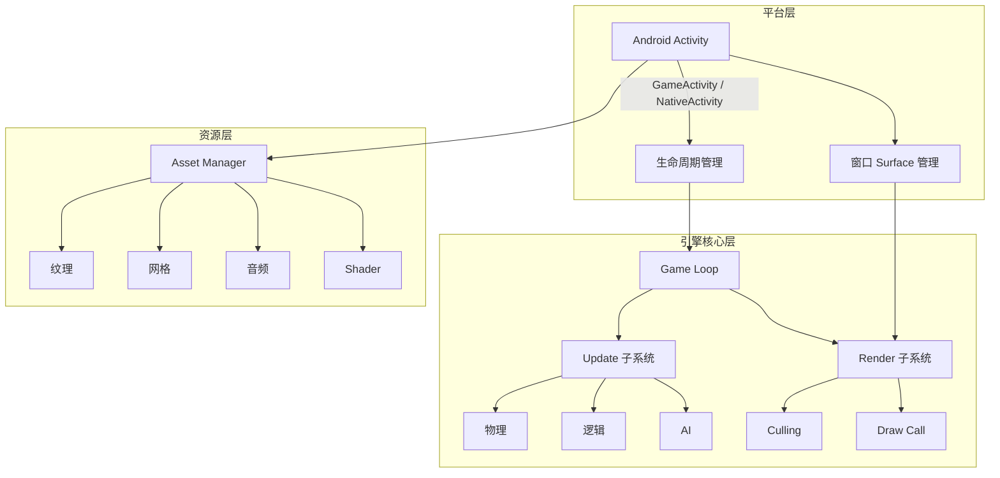
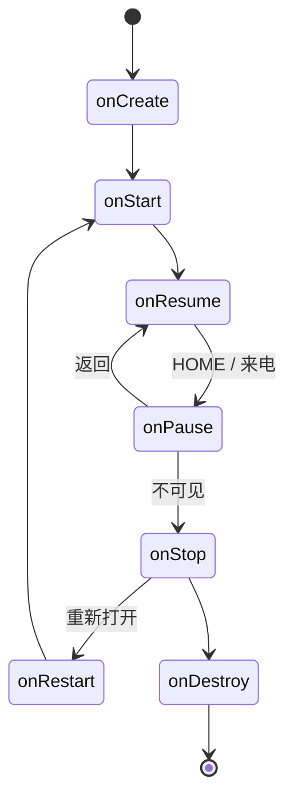
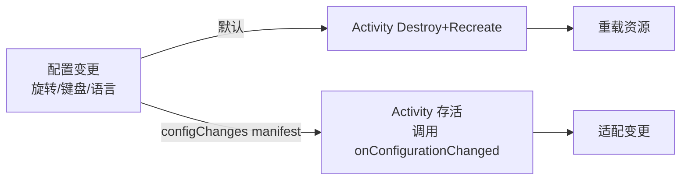
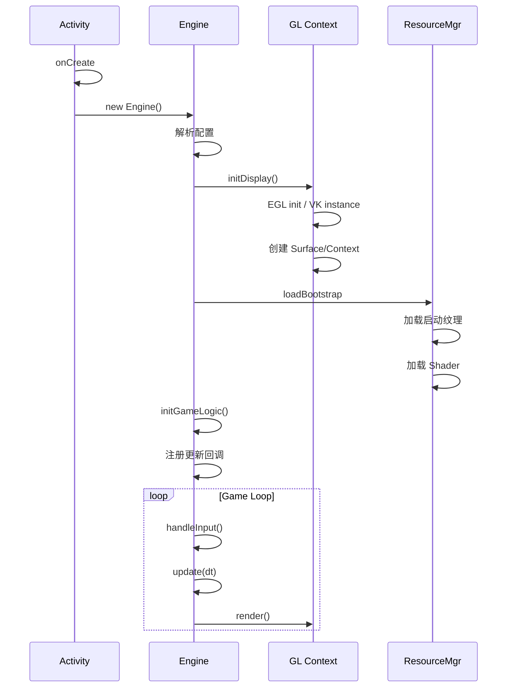
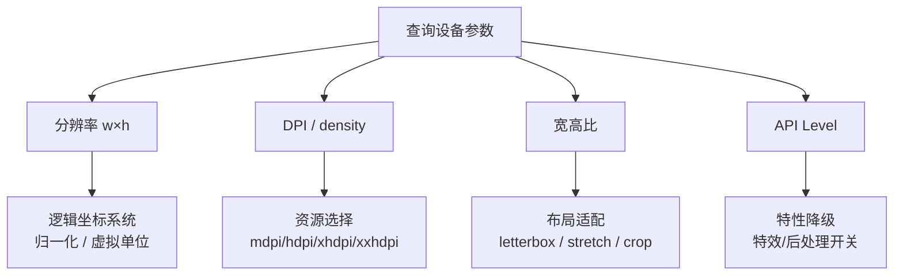

# Android 游戏架构标准

> 行业标准参考：Android NDK 指南、Google Game Development Kit、GameActivity 最佳实践

---

## 1. 架构模式

### 推荐分层架构



### 架构选型决策

| 方案 | 适用场景 | 优点 | 缺点 |
|------|---------|------|------|
| **纯 Native (NDK)** | 高性能 3D 游戏 | 完全控制、最低开销 | 开发效率低 |
| **GameActivity** | 中度复杂游戏 | 官方支持、触摸/手柄原生 | 较新，生态不成熟 |
| **Unity/Unreal** | 跨平台大型游戏 | 成熟工具链、快速开发 | 包体大、控制力弱 |
| **Kotlin + Vulkan** | 小型 2D/3D | 类型安全、现代 API | 性能损耗 |

## 2. Activity 生命周期管理

### 标准状态机



### 游戏资源生命周期映射

| Activity 回调 | 游戏操作 | 超时约束 |
|--------------|---------|---------|
| `onCreate` | 加载引擎、初始化 GL context | 5s (ANR) |
| `onResume` | 恢复 EGL context、重载纹理 | 无严格限制 |
| `onPause` | 保存状态、释放 GL context | 立即 (onPause 后可能被杀) |
| `onStop` | 保存持久数据 | 无 (但建议尽快) |
| `onDestroy` | 释放所有资源 | 无 |

### Android 配置变更处理



**建议：** 在 `AndroidManifest.xml` 声明 `android:configChanges="orientation|screenSize|screenLayout|keyboardHidden"` 避免不必要的重建。

## 3. 线程模型

### 标准线程架构

```mermaid
graph TB
    subgraph 主线程 (UI Thread)
        A[Activity 回调]
        B[Input 收集]
    end

    subgraph 渲染线程
        C[GL/VK Context]
        D[Frame 提交]
    end

    subgraph 工作线程池
        E[资源加载]
        F[物理计算]
        G[网络 IO]
        H[音频解码]
    end

    A -->|Handler/MQ| C
    B --> C
    E -.->|纹理上传| C
```

### 线程安全规则

```
1. 渲染线程独占 GL/VK Context
2. 资源加载在工作线程完成，纹理上传在主渲染线程
3. 游戏状态更新在渲染线程或独立逻辑线程
4. 跨线程通信使用:
   - 无锁 SPSC 队列 (帧级命令缓冲)
   - std::atomic 状态标志
   - Android MessageHandler
5. 避免: std::mutex 在渲染路径中争用
```

## 4. 引擎初始化流程



## 5. 状态持久化

### 存档规范

```yaml
存档格式:
  - 推荐: Protocol Buffers / FlatBuffers / JSON
  - 避免: Java 序列化 (性能差、版本兼容困难)

保存时机:
  - onPause() → 强制保存
  - 每 N 分钟 → 自动存档
  - 每次关键操作后 →  checkpoint

字段规范:
  game_version: string        # SemVer 格式
  save_version: int           # 存档格式版本号
  timestamp: int64            # Unix 时间戳
  checksum: string            # SHA256 防篡改校验
```

## 6. Android Manifest 配置规范

```xml
<!-- 游戏推荐配置 -->
<manifest>
    <!-- 硬件要求 -->
    <uses-feature android:glEsVersion="0x00030000" android:required="true"/>
    <uses-feature android:name="android.hardware.touchscreen" android:required="true"/>

    <!-- 权限声明（最小化） -->
    <uses-permission android:name="android.permission.WRITE_EXTERNAL_STORAGE"
        android:maxSdkVersion="28"/>

    <!-- Activity 配置 -->
    <activity
        android:configChanges="orientation|screenSize|screenLayout|keyboardHidden"
        android:screenOrientation="sensorLandscape"
        android:theme="@android:style/Theme.NoTitleBar.Fullscreen">

        <!-- 原生游戏入口 -->
        <meta-data android:name="android.app.lib_name" android:value="game"/>
    </activity>
</manifest>
```

## 7. 设备碎片化处理策略

### 屏幕适配



### GPU 厂商应对

```
Adreno (Qualcomm): 全覆盖，优化成熟
Mali (ARM):      注意 alpha 测试性能，避免 early-z 陷阱
PowerVR (IMG):   注意 tiled-based 延迟渲染优化
Mali 早期 GPU:   谨慎使用 compute shader
```
