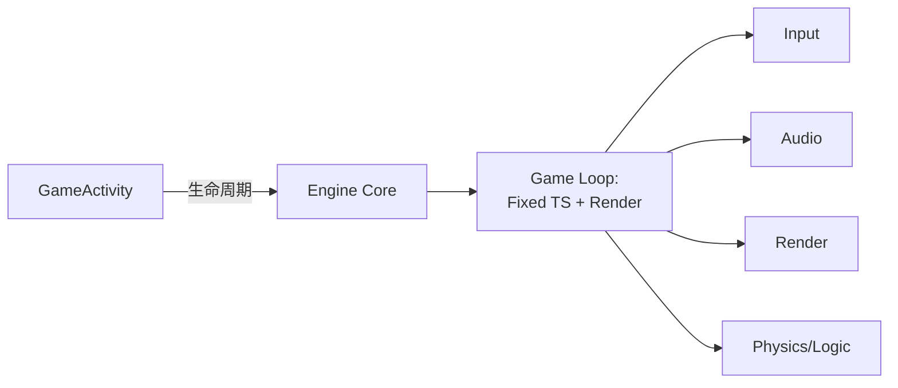

# Android 游戏开发速查总览

> 行业标准参考汇总 — 适用于 Native (NDK) + OpenGL ES 3.0 游戏开发

---

## 1. 核心架构



### 关键参数

```
Game Loop:     Fixed dt = 1/60s
               Max frame dt = 0.25s
Target FPS:    60 (旗舰) / 30 (入门)
EGL Config:    RGBA8 + Depth24 + ES 3.0
Thread Model:  Render Thread + Worker Pool
```

## 2. 文件结构模板

```
project/
├── app/
│   ├── src/main/
│   │   ├── java/com/game/        # Kotlin/Java
│   │   │   └── MainActivity.kt   # GameActivity 入口
│   │   ├── cpp/
│   │   │   ├── CMakeLists.txt
│   │   │   ├── main.cpp          # android_main + loop
│   │   │   ├── Renderer.h/.cpp   # 核心渲染 + 逻辑
│   │   │   ├── Shader.h/.cpp     # GLSL 编译
│   │   │   ├── Model.h           # 顶点数据
│   │   │   ├── TextureAsset.h/.cpp
│   │   │   ├── BitmapFont.h/.cpp
│   │   │   ├── AudioEngine.h/.cpp # Oboe 音频
│   │   │   └── InputHandler.h/.cpp
│   │   ├── assets/
│   │   └── res/
│   └── build.gradle.kts
├── openspec/specs/               # 规格文档
└── docs/                         # 知识库
```

## 3. 性能对照速查

| 领域 | 正常 | 警告 | 严重 |
|------|------|------|------|
| 帧率 (旗舰) | ≥ 55fps | 45-55fps | < 45fps |
| 帧率 (中端) | ≥ 28fps | 25-28fps | < 25fps |
| GPU 利用率 | < 70% | 70-90% | > 90% |
| Draw Calls | < 200 | 200-500 | > 500 |
| 纹理内存 | < 500MB | 500MB-1GB | > 1GB |
| CPU 内存 (PSS) | < 1GB | 1-2GB | > 2GB |
| 冷启动 | < 3s | 3-5s | > 5s |
| ANR 率 | 0% | < 0.1% | > 0.1% |
| 包体大小 | < 100MB | 100-200MB | > 200MB |

## 4. 推荐库清单

| 领域 | 推荐库 | 替代方案 |
|------|--------|---------|
| **原生入口** | GameActivity | NativeActivity (旧) |
| **渲染 API** | OpenGL ES 3.0 | Vulkan 1.1+ (高性能) |
| **音频** | Oboe 1.9+ | OpenSL ES (旧) |
| **输入** | GameActivity Input | GLFW (PC 端) |
| **2D 物理** | Box2D | Chipmunk2D |
| **3D 物理** | Jolt Physics | Bullet Physics |
| **数学** | GLM | DirectXMath |
| **序列化** | FlatBuffers | Protobuf / nlohmann_json |
| **单元测试** | GoogleTest | Catch2 |
| **性能分析** | Perfetto + RenderDoc | Snapdragon Profiler |

## 5. 构建命令速查

```bash
# Debug
./gradlew assembleDebug

# Release
./gradlew assembleRelease

# App Bundle (Play Store)
./gradlew bundleRelease

# 运行单元测试
./gradlew testDebugUnitTest

# Native 测试 (Host)
cd build && cmake .. && make && ctest

# 符号化 Native 崩溃
ndk-stack -sym app/build/intermediates/merged_native_libs/release/ \
          -dump crash.dump

# 检查 APK 内容
unzip -l app/build/outputs/apk/debug/app-debug.apk

# 安装到设备
adb install -r app/build/outputs/apk/debug/app-debug.apk
```

## 6. AndroidManifest 快速配置

```xml
<application android:hasCode="false" android:debuggable="false">
    <activity
        android:name="com.google.androidgamesdk.GameActivity"
        android:screenOrientation="sensorLandscape"
        android:configChanges="orientation|screenSize|screenLayout|keyboardHidden"
        android:theme="@android:style/Theme.NoTitleBar.Fullscreen">

        <meta-data android:name="android.app.lib_name"
                   android:value="game" />
    </activity>
</application>
```

## 7. 项目设置速查

| 参数 | 推荐值 | 原因 |
|------|--------|------|
| `compileSdk` | 36 | 最新 SDK 功能 |
| `minSdk` | 24 | 覆盖 95%+ 设备 |
| `targetSdk` | 36 | 新版本行为适配 |
| `ndkVersion` | 26.1+ | CMake 3.22+ / LTO |
| `abiFilters` | arm64-v8a | 85%+ 设备 |
| `GLES version` | 3.0 | 98%+ 设备支持 |
| `R8 minify` | true (release) | 减小包体 + 混淆 |
| `prefab` | true (game-activity) | 原生依赖管理 |

## 8. 关键规范链接

```
OpenGL ES 3.0 规范:            https://www.khronos.org/registry/OpenGL/specs/es/
Android NDK 指南:              https://developer.android.com/ndk/guides
GameActivity 使用:             https://developer.android.com/games/agdk/game-activity
Oboe 音频库:                  https://github.com/google/oboe
Perfetto 性能分析:             https://perfetto.dev/
Firebase Test Lab:            https://firebase.google.com/docs/test-lab
Android Vitals:               https://play.google.com/console/about/vitals/
Play Asset Delivery:          https://developer.android.com/guide/playcore/asset-delivery
```
