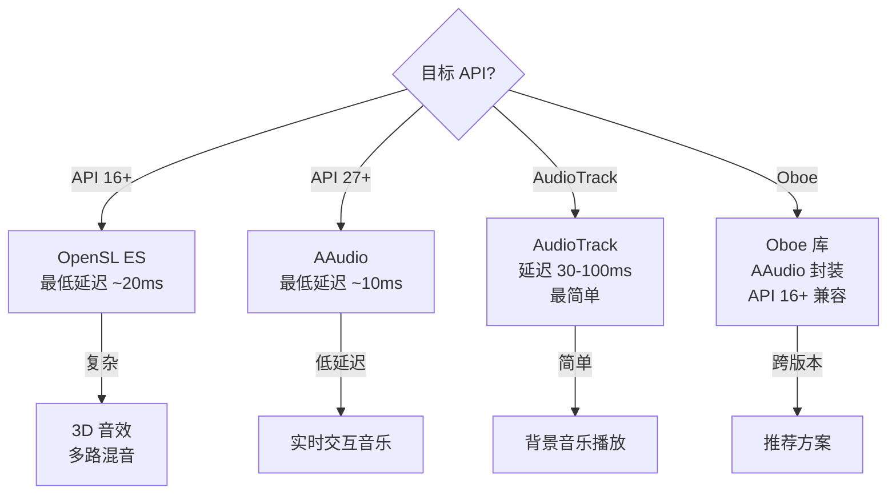
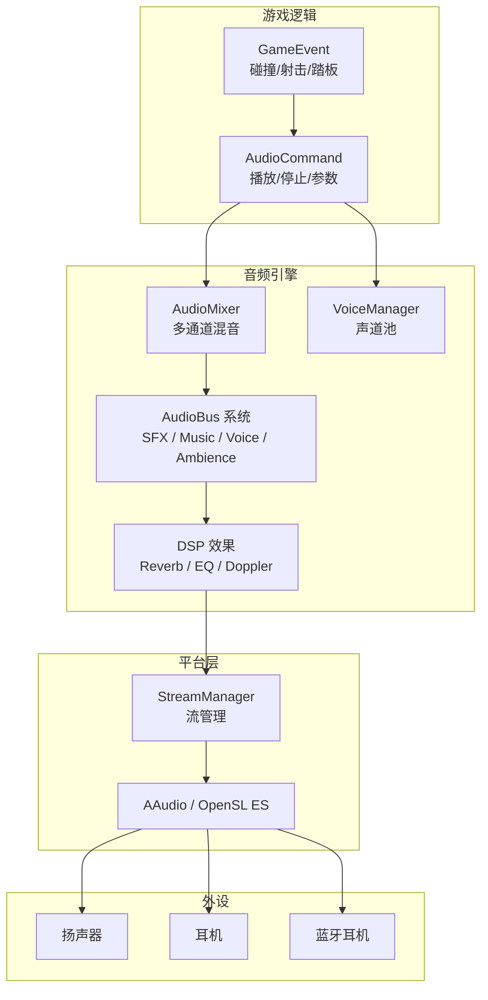
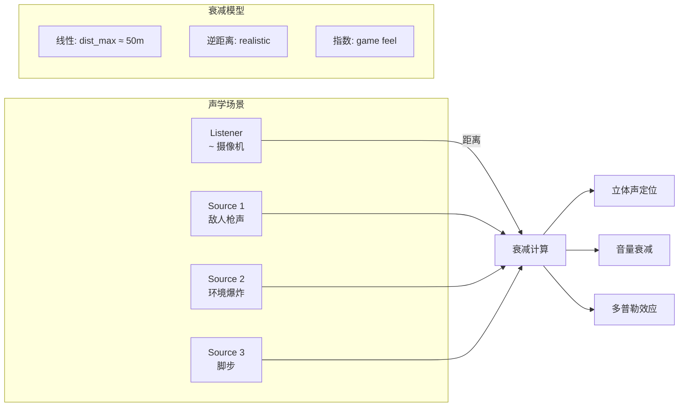
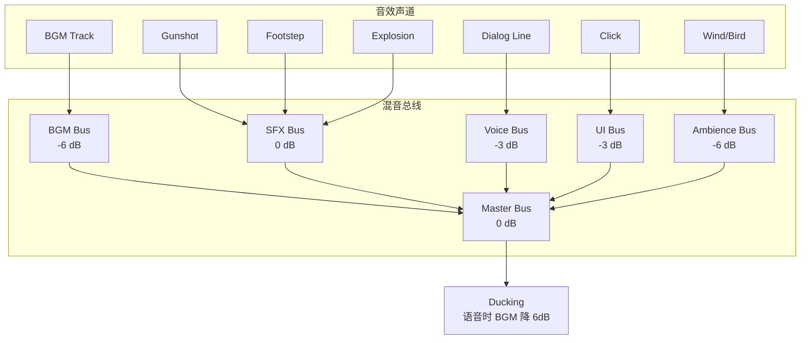

# Android 游戏音频系统标准

> 行业标准参考：OpenSL ES 规范、AAudio API、Wwise/FMOD 集成指南

---

## 1. API 选型



### 推荐：Oboe 库

```
Oboe 优点:
  - API 16+ 统一接口 (底层自动选择 AAudio/OpenSL)
  - 低延迟 (AAudio 路径 < 10ms)
  - 官方维护 (Google)
  - C++ 原生接口

集成:
  dependencies:
    - implementation("com.google.oboe:oboe:1.9.0")

  CMake:
    find_library(oboe oboe)
    target_link_libraries(game oboe)
```

## 2. 音频架构



## 3. 声音资源管理

### 音频格式选择

| 格式 | 比特率 | 场景 | 压缩 | 延迟 |
|------|--------|------|------|------|
| AAC | 128-320kbps | 背景音乐 | 有损 | 高 (需解码) |
| MP3 | 128-320kbps | 兼容 | 有损 | 高 (需解码) |
| OGG Vorbis | 96-256kbps | 音乐+SFX | 有损 | 中 |
| Opus | 32-128kbps | 语音 | 有损 | 低 |
| WAV/PCM | 1411kbps (16bit) | SFX/UI | 无损 | 极低 |
| ADPCM | 352kbps | SFX 压缩 | 无损/压缩 | 低 |

### 音频资源配置

```yaml
资源分类:
  BGM:         背景音乐 (OGG, 128kbps, 立体声, 44.1kHz)
  SFX:         音效 (WAV/ADPCM, 单声道, 22.05kHz)
  VOICE:       语音 (Opus, 32kbps, 单声道, 16kHz)
  UI:          UI 音效 (WAV/ADPCM, 单声道, 22.05kHz)

内存预算:
  同时加载:
    BGM:  1 首 ≈ 5-20MB (流式解码 500KB buffer)
    SFX:  50-100 个 ≈ 5-10MB
    VOICE: 10-20 条 ≈ 1-2MB

  同时播放:
    SFX:     ≤ 16 voices
    BGM:     ≤ 1 voice
    VOICE:   ≤ 2 voices
    UI:      ≤ 4 voices
```

## 4. 3D 音频规格

### 监听器与声源



### 衰减参数

```
线性衰减:   gain = 1 - clamp(distance/range, 0, 1)
逆距离:     gain = 1 / (1 + distance * rolloff)
指数:       gain = pow(1/distance, exponent)
多普勒:     pitch_shift = (v_source + v_listener) / speed_of_sound

推荐默认:
  最小距离:    1m     (全音量)
  最大距离:    50m    (静音)
  滚降系数:    1.0    (线性)
  多普勒:      1.0    (物理正确或按需)
```

## 5. 动态混音总线



### Ducking 规则

```
触发: Voice 总线有活动
     → BGM 总线音量 -6dB (衰减时间 100ms)
     → 恢复: 语音停止后 500ms 恢复 (恢复时间 200ms)

优先级: Voice > SFX > BGM
```

## 6. 音频延迟标准

### 端到端延迟

```
Oboe (AAudio 路径):
  播放延迟:   ~10-15ms
  录制延迟:   ~15-20ms

OpenSL ES:
  播放延迟:   ~20-40ms
  录制延迟:   ~30-50ms

AudioTrack:
  播放延迟:   ~30-100ms

目标:
  触觉反馈音效:   < 20ms (和触摸同步)
  UI 音效:         < 30ms
  环境/BGM:        < 100ms (容忍度高)
```

### 低延迟配置

```
Oboe 首选设置:
  sampleRate:      设备原生采样率 (query via AAudioStreamBuilder)
  samplesPerFrame: 2 (立体声) / 1 (单声道)
  format:          16-bit PCM (最低功耗)
  sharingMode:     EXCLUSIVE (独占低延迟)
  performanceMode: LOW_LATENCY
  bufferCapacity:  双缓冲 (最小安全值)

回调:
  AudioStreamDataCallback → 填充下一个 buffer
  确保回调内无锁/无分配
```
