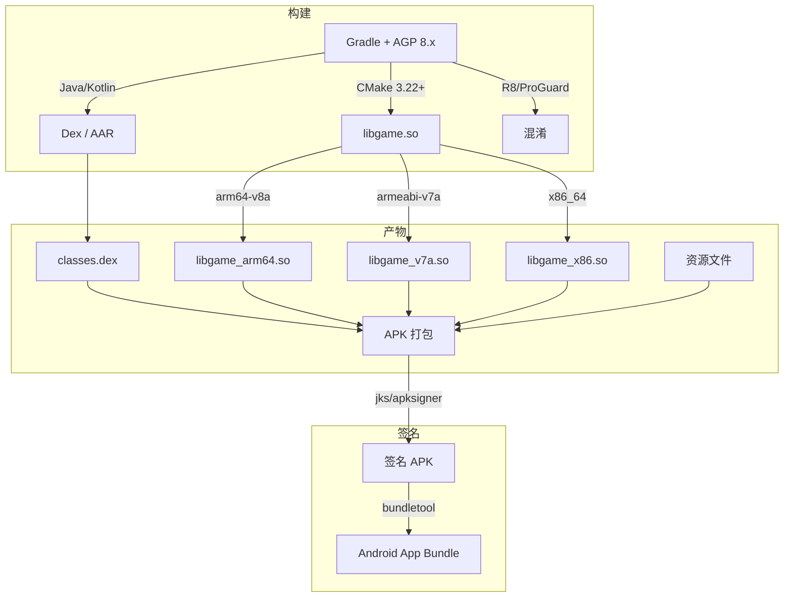
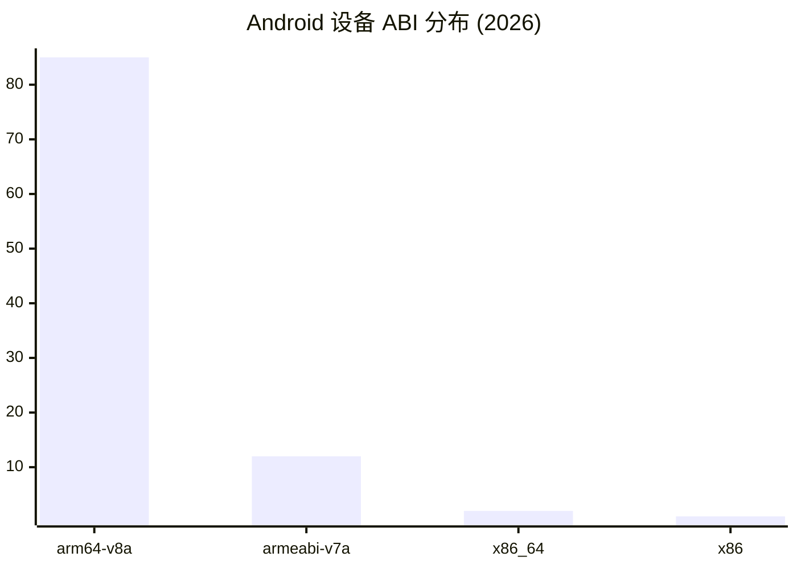
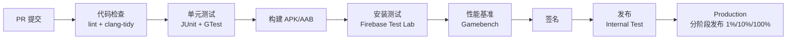

# Android 游戏构建与部署标准

> 行业标准参考：Android Gradle Plugin 指南、Google Play Console 发布规范、NDK 构建指南

---

## 1. 构建系统

### 推荐工具链



### build.gradle.kts 标准结构

```kotlin
plugins {
    id("com.android.application") version "8.13.0" apply false
    id("org.jetbrains.kotlin.android") version "2.0.21" apply false
}

android {
    compileSdk = 36
    ndkVersion = "26.1.10909125"

    defaultConfig {
        minSdk = 24  // 覆盖 ~95% 设备
        targetSdk = 36
        ndk {
            abiFilters += listOf("arm64-v8a", "armeabi-v7a")
            // x86_64 仅用于模拟器调试
        }
    }

    buildTypes {
        release {
            isMinifyEnabled = true
            isShrinkResources = true
            proguardFiles("proguard-rules.pro")
        }
        debug {
            isDebuggable = true
            isJniDebuggable = true
        }
    }

    // CMake 原生构建
    externalNativeBuild {
        cmake {
            path = file("src/main/cpp/CMakeLists.txt")
            version = "3.22.1+"
        }
    }
}
```

## 2. ABI 策略

### 支持范围



### 推荐策略

```
Release (Play Store):
  arm64-v8a:  必选 (85%+ 设备)
  armeabi-v7a: 可选 (12% 兼容)

Debug (开发):
  arm64-v8a:   必选
  armeabi-v7a: 可选 (测试老旧设备)
  x86_64:      推荐 (模拟器加速)

不建议:
  - x86:  < 0.1% 设备
  - mips/mips64: 已废弃
```

### 合并所有 ABI 到单一 APK

```kotlin
// 默认 Gradle 打包所有 ABI 到 APK
// 建议通过 App Bundle (AAB) 分发，Google Play 自动生成 split APK
// bundletool 生成 Android App Bundle

// 如需单 APK 多 ABI:
splits {
    abi {
        isEnable = true
        reset()
        include("arm64-v8a", "armeabi-v7a")
        isUniversalApk = false
    }
}
```

## 3. 版本命名规范

### SemVer 格式

```
主版本.次版本.补丁-预发布+构建元数据
  2.3.1-alpha+20260621

规则:
  主版本: 不兼容 API 变更
  次版本: 向下兼容功能新增
  补丁:   向下兼容问题修复
  预发布: alpha / beta / rc
```

### Android versionCode 与 versionName

```kotlin
android {
    defaultConfig {
        // 版本递增规则:
        // versionCode = 单调递增整数
        //  方案 A: MMmmPP (2.3.1 → 020301 → 20301)
        //  方案 B: YYMMDD + 当天序号 (20260621 + 01)
        versionCode = 20260621

        // versionName = 用户可见的版本
        versionName = "2.3.1"
    }
}
```

## 4. 构建变体

### 风味维度

```kotlin
flavorDimensions("environment", "distribution")

productFlavors {
    // 环境
    dev {
        dimension = "environment"
        applicationIdSuffix = ".dev"
        versionNameSuffix = "-dev"
    }
    staging {
        dimension = "environment"
        applicationIdSuffix = ".staging"
        versionNameSuffix = "-staging"
    }
    prod {
        dimension = "environment"
    }

    // 分发渠道
    googlePlay {
        dimension = "distribution"
    }
    amazon {
        dimension = "distribution"
        applicationIdSuffix = ".amazon"
    }
}
```

### 构建类型对比

| 类型 | debuggable | minifyEnabled | JNI debug | 签名 |
|------|-----------|--------------|-----------|------|
| **debug** | true | false | true | debug.keystore |
| **release** | false | true | false | release.jks |
| **profile** | true | false | false | release.jks |

## 5. CI/CD 流水线

### 推荐流程



### GitHub Actions 配置

```yaml
name: Android Game CI

on:
  push:
    branches: [main, develop]
  pull_request:

jobs:
  build:
    runs-on: ubuntu-latest
    steps:
      - uses: actions/checkout@v4
      - uses: actions/setup-java@v4
        with:
          distribution: 'zulu'
          java-version: 17

      - name: Build Debug APK
        run: ./gradlew assembleDebug

      - name: Run Unit Tests
        run: ./gradlew testDebugUnitTest

      - name: Build Release Bundle
        run: ./gradlew bundleRelease

      - name: Upload Artifact
        uses: actions/upload-artifact@v4
        with:
          name: app-bundle
          path: app/build/outputs/bundle/release/app-release.aab
```

## 6. Play Store 发布清单

### 上架前检查表

```
1. 清单清单
   □ 权限最小化: 仅声明必需权限
   □ 64-bit 支持: 必须包含 arm64-v8a
   □ Target SDK: 最新或前一个版本
   □ AndroidManifest 无调试标志

2. 安全
   □ APK/AAB 使用 release key 签名
   □ ProGuard/R8 混淆启用
   □ 无硬编码密钥/Token
   □ 网络使用 HTTPS

3. 性能
   □ 帧率 ≥ 30fps 在参考设备
   □ 冷启动 < 5s
   □ 无 ANR (测试 200+ 设备)
   □ 内存峰值 < 设备上限 80%

4. 商店信息
   □ 商店截图 (至少 2 张手机 + 1 张平板)
   □ 特征图形 (1024×500)
   □ 隐私政策 URL
   □ 内容分级问卷
```

## 7. 热修复与更新

### Play 更新库

```kotlin
// Play In-App Updates API
val appUpdateManager = AppUpdateManagerFactory.create(this)
val appUpdateInfo = appUpdateManager.appUpdateInfo.await()

if (appUpdateInfo.updateAvailability() == UpdateAvailability.UPDATE_AVAILABLE
    && appUpdateInfo.isUpdateTypeAllowed(AppUpdateType.IMMEDIATE)) {
    appUpdateManager.startUpdateFlowForResult(
        appUpdateInfo,
        AppUpdateType.IMMEDIATE,
        this,
        REQUEST_CODE_UPDATE
    )
}
```

### 更新策略

```yaml
立即更新 (IMMEDIATE):
  场景: 关键安全修复、破坏性变更
  行为: 弹窗强制更新，否则退出

灵活更新 (FLEXIBLE):
  场景: 功能更新、性能优化
  行为: 提示"稍后更新"/"立即更新"
  后台下载，下次启动自动安装

资源包更新 (Play Asset Delivery):
  场景: 新增关卡/皮肤/活动
  行为: 运行时按需下载，无需版本更新
```
