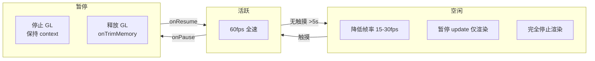
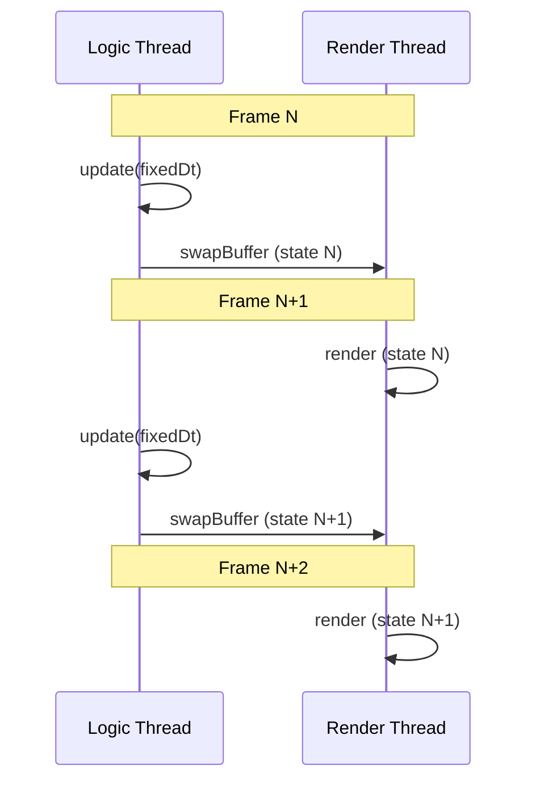
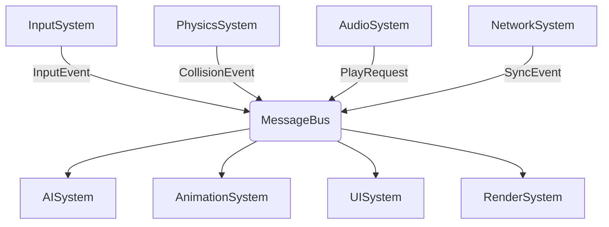

# Android 游戏循环与引擎设计标准

> 行业标准参考：Game Programming Patterns、Fix Your Timestep (Gaffer on Games)、Android NDK 指南

---

## 1. 游戏循环模式

### 三种主流方案对比

```mermaid
flowchart LR
    subgraph Fixed TS [固定时间步长]
        A1[固定 dt = 1/60s] --> B1[update]
        B1 --> C1[render]
        C1 --> D1{累积 > dt?}
        D1 -->|是| B1
        D1 -->|否| A1
    end

    subgraph Variable TS [可变时间步长]
        A2[实际 dt = now-last] --> B2[clamp dt]
        B2 --> C2[update(dt)]
        C2 --> D2[render]
        D2 --> A2
    end

    subgraph Semi-Fixed [半固定]
        A3[实际 dt] --> B3[accum += dt]
        B3 --> C3{accum >= fixedDt?}
        C3 -->|是| D3[update(fixedDt)]
        D3 --> E3[accum -= fixedDt]
        E3 --> C3
        C3 -->|否| F3[render(interpolate)]
        F3 --> A3
    end
```

### 推荐：固定时间步长 + 插值渲染

```
核心参数:
  FIXED_DT     = 1/60  (约 16.67ms)
  MAX_FRAME_DT = 0.25s (物理帧最大间隔，防螺旋)
  ACCUMULATOR  = 0     (累积时间)

每帧:
  1. currentTime = now()
  2. frameDt = currentTime - lastTime
  3. frameDt = min(frameDt, MAX_FRAME_DT)    // 防螺旋
  4. lastTime = currentTime
  5. accumulator += frameDt

  while (accumulator >= FIXED_DT):
    update(FIXED_DT)                          // 固定步长更新
    accumulator -= FIXED_DT

  6. alpha = accumulator / FIXED_DT          // 插值因子
  7. render(alpha)                           // 渲染（可插值）

优点:
  - 物理/逻辑更新确定性
  - 不同帧率设备行为一致
  - 可超采样渲染（update 多次后 render 一次）

注意:
  - accumulator 上限防止螺旋
  - update 应该自包含（不依赖外部 dt 精度）
  - render(alpha) 可选，简单游戏可忽略
```

## 2. 帧率管理策略

```mermaid
flowchart TB
    START[每帧开始] --> PERF{当前帧耗时}

    PERF -->|< 16ms (60fps)| F60[全速渲染<br/>～60fps]
    PERF -->|16-33ms (30-60fps)| F30[降帧率: skip一帧更新<br/>or 降低渲染品质]
    PERF -->|> 33ms (< 30fps)| THROTTLE[强制降质<br/>关闭特效<br/>降低分辨率]

    F60 --> NEXT
    F30 --> NEXT
    THROTTLE --> NEXT
    NEXT -->[下一帧]
```

### API 级别帧率控制

```java
// Android 14+ 支持动态帧率
// Force 60fps
SurfaceControl.setFrameRate(
    0,  // 默认刷新率使用
    SurfaceControl.FRAME_RATE_CATEGORY_NORMAL
);

// 低功耗模式 (30fps)
SurfaceControl.setFrameRate(
    30,
    SurfaceControl.FRAME_RATE_CATEGORY_LOW_LATENCY
);
```

### 设备帧率感知

| 刷新率 | 设备范例 | 推荐策略 |
|--------|---------|---------|
| 60Hz | 主流设备 | 锁定 60fps 或自适应 |
| 90Hz | 中高端 (OnePlus 7 Pro 等) | 开启 90fps 模式 |
| 120Hz | 旗舰 (ROG Phone, iPad Pro) | 自适应，不低于 60fps |
| 144Hz | 游戏手机 | 按需锁定 120/60 |

## 3. 空闲模式与功耗优化



## 4. 渲染与更新分离

### 逻辑更新顺序

```
每一 tick (fixedDt):
  1. 输入采样 → 缓冲
  2. 物理模拟 → 碰撞检测
  3. 游戏逻辑 → AI/动画/粒子
  4. 摄像机更新
  5. 音频状态
  6. 网络同步（如有）

每渲染帧:
  1. 更新 GPU 缓冲区
  2. 执行渲染命令
  3. eglSwapBuffers / vkQueuePresent
```

### 渲染帧与逻辑帧异步



## 5. 引擎模块通信

### 消息总线模式



### 事件优先级

| 优先级 | 类型 | 示例 | 处理时序 |
|--------|------|------|---------|
| P0 | 关键 | 生命周期、内存警告 | 立即 |
| P1 | 输入 | 触摸、按键 | 下一帧开始 |
| P2 | 游戏 | 碰撞、得分 | 下一 update |
| P3 | 通知 | 成就、UI 更新 | 延迟可接受 |

## 6. 时间管理

### 时间缩放

```cpp
enum class TimeScale {
    NORMAL = 1,           // 正常速度
    SLOW_MO = 0.3f,       // 慢动作
    PAUSED = 0.0f,        // 暂停
    FAST_FORWARD = 2.0f   // 快进（调试）
};

// 每帧更新
float gameDt = rawDt * currentTimeScale;
```

### 时间源选择

| 时钟源 | 精度 | 暂停耐受 | 跨帧一致 | 推荐用途 |
|--------|------|---------|---------|---------|
| `steady_clock` | 纳秒 | 否 | 是 | 引擎 dt |
| `system_clock` | 纳秒 | 是（用户调时间） | 否 | 存档时间戳 |
| `performance_counter` | 纳秒 | 否 | 是 | 性能分析 |
| `uptimeMillis` | 毫秒 | 否 | 是 | SDK 时间戳 |
