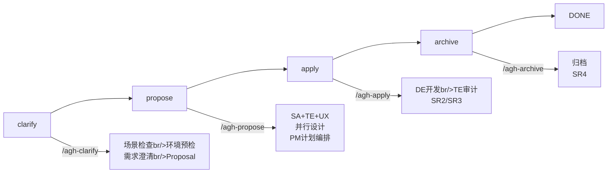
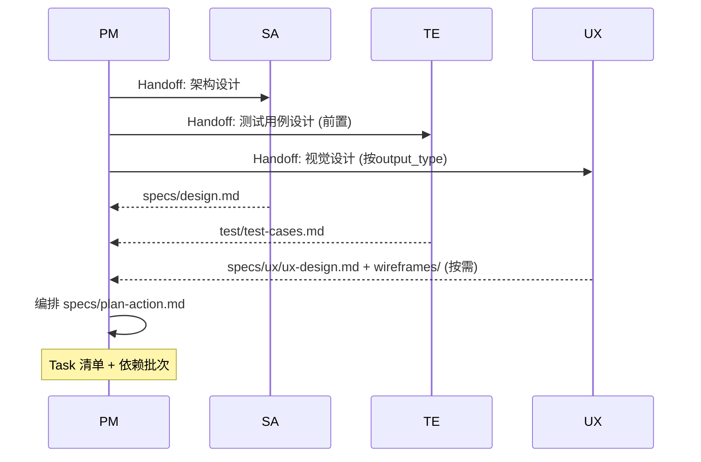

# Android Game Harness 整体流程（已验证版）

> 基于 S001 (standard+documentation) → REQ002 (standard+android-game) 两次全流程运行的已验证模式。?> → CLAUDE.md 全局纪律保持一致。。
---

## 1. 流程总览



## 2. 角色职责矩阵

| 角色 | Propose 阶段 | Apply 阶段 | Archive 阶段 |
|------|-------------|-----------|-------------|
| **SA** | 技术方案设计+ Task 分解 | → | (归档设计) |
| **BA** | 需求规格分析(→ full) | → | (归档需求 |
| **TE** | 测试用例设计 (前置) | 审计执行 (后置) | → |
| **UX** | 视觉/结构设计 (按需) | → | (归档设计) |
| **DE** | → | TDD 编码实现 | → |
| **PM** | 计划编排 handoff | 派发 handoff 进度跟踪 | 归档检查|

## 3. clarify 阶段（需求初始化）。
### 入口
- `/agh-clarify` → `/agh-run` 自动进入
- Skill: `skills/agh-clarify.md`

### 步骤
```
SCENE_DETECT → ENV_PRECHECK → INIT_DIR → CLARIFY → SET_OUTPUT_TYPE → SET_MODE → PROPOSAL_FINALIZE
```

### 场景检查| 场景 | 判定条件 | 行为 |
|------|---------|------|
| NEW | .state.md 空或无文件| 新建 REQ-{N} |
| RESUME | .state.md phase != done | 从当前位置恢复?|
| CHANGE | 已有 done 的需求，需变更 | 基于上游 spec 创建变更 |

### 环境预检
自动检查`tech_stack` 各字段：
- `.state.md` 缓存（存在时直接读取，避免重复检测）
- 首次检测：分析项目根目标package.json / pyproject.toml / Cargo.toml / build.gradle.kts → - `browser_available` 检测：`npx playwright --version` → `which chromium`

### 产出类型与测试策略
| output_type | 默认 test_strategy | UX 介入 | BA 介入 |
|-------------|-------------------|---------|---------|
| documentation | manual | 仅结构设计| → |
| android-game | unit | → | ✓（全流程开发） |
| android-app | unit | ✗（UI 布局纳入 SA 设计师| ✓（全链路开发） |
| backend-api | integration | → | → |
| cli-tool | integration | → | → |
| library | unit | → | → |
| data-pipeline | smoke | → | → |
| infrastructure | smoke | → | → |
| custom | 用户指定 | 按需 | 按需 |

### Proposal 定稿格式

```yaml
## 背景与目录## 范围（包含不包含）
## 关键约束
## 参考资料## 验收标准
```

## 4. propose 阶段（设计计划）。
### 入口
- `specs/proposal.md` 确认通过期?- Skill: `skills/agh-propose.md`

### 模式裁剪

| 模式 | SA | TE (前置) | UX | BA | SR1 |
|------|----|----------|----|----|-----|
| fast | → | → | → | → | → |
| standard | → | → | 按output_type | → | → |
| full | → | → | 按output_type | → | → |

### 并行工作流（standard 模式 ）?已验证）



### SA 设计产出 (已验证。
```
specs/design.md
```
内容: 技术选型 → 架构概述 → Task 清单 → 需求↔Task 追溯
### TE 测试用例设计产出 (已验证。
```
test/test-cases.md
```
内容: A→ 存在线? → B→ 内容完整 → C→ 流程一致。? → [MANUAL VERIFICATION] 清单
### UX 设计产出（按 output_type）。
| output_type | 产出内容 |
|-------------|---------|
| android-app | UI 布局 / 状态机 / 渲染层级 specs（整合到架构设计中） |
| documentation | 结构骨架 |
| android-game | UX 仅参与界面布局设计（按钮坐标、状态流转规格），产出在 spec 中而非 wireframe |

UX → android-game 项目中主要负责界面布局和交互流程的设计，产出整合到 SA 架构 specs 对应。?button-menu-spec.md 中间。
### plan-action.md 格式 (已验证。

```markdown
# 执行计划: {feature-name}
- 模式: {mode}
- 产出类型: {output_type}
- 批次: N → 
## Batch-1 (独立任务, 可并发。
- Task-1: {描述} [deps: none]
- Task-2: {描述} [deps: none]

## Batch-2 (依赖前批)
- Task-N: {描述} [deps: Task-M]
```

## 5. apply 阶段（开发审计+验收缩。
### 入口
- `plan-action.md` 确认通过期?- Skill: `skills/agh-apply.md`

### 流程

```mermaid
graph TB
    subgraph 逐批次执行        DE[DE 开发br/>TDD → dev-test → post-verify] --> TE[TE 审计]
        TE -->|PASS| NEXT{还有下批次}
        TE -->|FAIL| REPAIR[修复循环<br/>DE自修×3<br/>PM派修×5]
        REPAIR --> DE
    end

    NEXT -->|是| DE
    NEXT -->|否| SR2[SR2 功能评审]
    SR2 --> SR3[SR3 最终评审]
    SR3 --> DONE[Apply完成]
```

### DE 开发流程（已验证）

```
TDD: 写测试。?实现 → 重构
→ dev-test (skills/dev-test.md)
→ post-verify (skills/post-verify.md)
→ code-report.md
```

### TE 审计流程（已验证
| 审计阶段 | 时机 | 内容 | 输出 |
|---------|------|------|------|
| TEST-1 (逐任务 | 每个 DE handoff → | 验证产出物存储+ 基本功能 | temp-test-report.md |
| TEST-2 (最终审批 | 所有批次完成后 | 回归全部测试用例 | final-test-report.md |

### 验收门禁标准

| 门禁 | 触发条件 | 通过标准 | role |
|------|---------|---------|------|
| **SR2** | 所有批次开发完整| 1. DE code-reports 全部 done<br/>2. TEST-1 全部报告 temp 通过<br/>3. 无修复循环中的未解决问题 | PM → 用户 |
| **SR3** | SR2 通过期?| 1. final-test-report 全部 PASS<br/>2. 无占位符/TODO 残留<br/>3. dev-test 自检通过 | PM → 用户 |
| **SR4** | archive 完成。| 1. 归档清单完整<br/>2. 输出产物验证通过 | PM → 用户 |

### 修复循环

```
DE 自修 (内部循环):
  attempt=0 → detect failure → attempt++ (max 3)
  → 每次尝试: 修复 → dev-test
  → 3 次失败后回报 PM

PM 派修 (外部循环):
  repair_round=0 → PM 收到失败 → repair_round++ (max 5)
  → 重新派发 DE handoff
  → repair_round > 5 → 上报人工介入
```

## 6. archive 阶段（归档结项目
### 入口
- SR3 通过后自动推进（fast 跳过，standard/full 执行- Skill: `skills/agh-archive.md`

### 归档
| 步骤 | full | standard | fast |
|------|------|----------|------|
| ARC-1 需求归档| specs/ 归档 | → | → |
| ARC-2 设计归档 | sa/design.md → specs/ | sa/design.md → specs/ | → |
| ARC-3 产出物归档| output/ → 归档 | output/ → 归档 | output/ → 归档 |
| SR4 结项 | 完整 | 简单?| → |

### 合并策略
```
新增 → 追加标注 [新] {内容}
修改 → 替换对应段落 + [修订: {日期}]
删除 → [废弃: {日期}] 标记
```

## 7. 状态管理体系。
### `.state.md`（全局状态）

```yaml
# req_id →ѷ→→→
mode: standard | full | fast
output_type: {type}

phase: init | propose | apply | archive | done
current_step: {STEP-ID}
current_role: PM | BA | SA | DE | TE | UX
current_handoff: "" → "handoff-filename.md"
completed_steps: ["INIT-1", "SA", ...]
auto_advance: true | false

repair_round: 0-5
repair_task: "" → "Task-N"

sr_status:
  SR1: pending | approved | rejected | skipped
  SR2: pending | approved | rejected | skipped
  SR3: pending | approved | rejected | skipped
  SR4: pending | approved | rejected | skipped

tech_stack:
  language: javascript | java | python | go | rust | unknown
  package_manager: npm | gradle | pip | go | cargo | ...
  test_framework: jest | gtest | pytest | ...
  build_tool: vite | gradle | ...
  lint_tool: eslint | ...

test_strategy: e2e | unit | integration | smoke | manual | none

env:
  browser_available: false

last_updated: "YYYY-MM-DDTHH:MM:SSZ"
```

### 步骤 ID 枚举

| 阶段 | 步骤 ID | 说明 | 执行角色 |
|------|---------|------|---------|
| init | INIT-1 | 初始化任务目标| PM |
| init | INIT-DONE | clarify 阶段完成 | PM |
| propose | BA | BA 需求分析(→ full) | BA |
| propose | SA | SA 架构设计 | SA |
| propose | TE | TE 测试用例设计 (前置) | TE |
| propose | PLAN | PM 计划编排 | PM |
| propose | UX | UX 视觉设计 (→ output_type) | UX |
| propose | PROPOSE-DONE | propose 阶段完成 | PM |
| apply | DEV-B{N} | DE 批量开发Batch-N | DE |
| apply | TEST-1-{N} | TE 逐批次审计Batch-N | TE |
| apply | SR2-DONE | SR2 功能评审通过 | PM |
| apply | TEST-2 | TE 最终审批| TE |
| apply | SR3-DONE | SR3 最终评审通过 | PM |
| archive | ARC-1 | 需求归档(→ full) | PM |
| archive | ARC-2 | 设计归档 (standard/full) | PM |
| archive | ARC-3 | 产出物归档| PM |
| archive | SR4-DONE | SR4 结项确认通过 | PM |

## 8. handoff 管理

### handoff 文件命名
```
{feature-name}-{STEP-ID}-R{round}.md
示例: S001-REQ2-R1.md, S001-DEV1-T1-R1.md
```

### handoff 传递路线。
```mermaid
graph LR
    PM -->|SA| SA
    PM -->|TE| TE
    PM -->|UX| UX
    PM -->|DEV-B{N}| DE
    PM -->|TEST-1| TE
    PM -->|TEST-2| TE
    SA -->|design.md| PM
    TE -->|testcases.md| PM
    UX -->|spec.md| PM
    DE -->|code-report.md| PM
    TE -->|test-report.md| PM
```

### handoff 轮次
- 首次: R1
- 修复重试: R2, R3, ... (最。?R5)
- handoff 文件不可修改，重试新。?R+1 文件

## 9. OpenSpec 集成

所有角色产出物遵循 skills/agh-openspec.md 管理版本和追溯：

| 角色 | Change 命名 | 产出路径 |
|------|------------|---------|
| BA | requirement-spec | specs/drafts/requirement-spec-v{N}.md |
| SA | design-{feature} | specs/drafts/design-v{N}.md |
| DE | code-task-{N} | specs/de-reports/drafts/code-report-v{N}.md |
| TE | test-{feature} | test/drafts/test-cases-v{N}.md |
| UX | ux-{feature} | specs/ux/drafts/ux-design-v{N}.md |

## 10. 脚本验证体系

| 脚本 | 用户| 执行时机 |
|------|------|---------|
| `npm run check` (scripts/check-harness.sh) | 框架完整性检查| 启动。?|
| `npm run verify [type] [REQ-ID]` | 交付物验证?A/B/C | propose/apply/archive |
| `npm run baseline [REQ-ID]` | baseline diff 检查| archive |
| `gradle test` + `ctest` | Android 双通道验证（Kotlin JUnit + C++ GTest）?| apply |

### verify 类型

| Type | 检查项 | 命令 |
|------|--------|------|
| A | 文件存在线?| `npm run verify A REQ{N}` |
| B | 内容完整性（output_type 感知会?| `npm run verify B REQ{N}` |
| C | 流程一致性（.state.md vs 实际产物）?| `npm run verify C REQ{N}` |
| all | A+B+C | `npm run verify all REQ{N}` |

## 11. 已验证流程参考
### S001 → standard + documentation
```
clarify → SA设计 + TE测试用例(并行) → PM计划(3批次) → 
DE Batch-1(6任务并行) → TE TEST-1 → user确认 → 
DE Batch-2 → TE TEST-1 → user确认 → DE Batch-3 → TE TEST-1 → user确认 → 
SR2 → TE TEST-2(final) → SR3 → archive → SR4
```

### REQ002 → standard + android-game (Native C++/OpenGL ES)
```
clarify → SA设计(含C++架构+渲染管线+ABI) + TE测试用例(含GTest+JUnit) → PM计划(分批依赖) → DE Batch-1(核心渲染) → TE TEST-1 → user确认 → DE Batch-2(游戏逻辑) → TE TEST-1 → user确认 → DE Batch-3(UI/输入) → TE TEST-1 → user确认 → SR2 → TE TEST-2(gradle test + ctest) → SR3 → archive → SR4
```

## 12. 常见问题处理

| 问题 | 处理方式 |
|------|---------|
| .state.md 不一切?| 以文件系统快照为准重复|
| handoff 超时 (pending >30min) | PM 自动重新派发 |
| DE 3 次自修失效?| 回报 PM，PM 决策是否继续下一切?|
| PM 5 轮修复仍失败 | 标记 `repair_round=5`，上报人工介。?|
| test_strategy=e2e → browser_available=false | 降级为工程检查，审计报告中标志|
| 文件写入后验证失效?| 立即重写，仍失败则回报PM |
