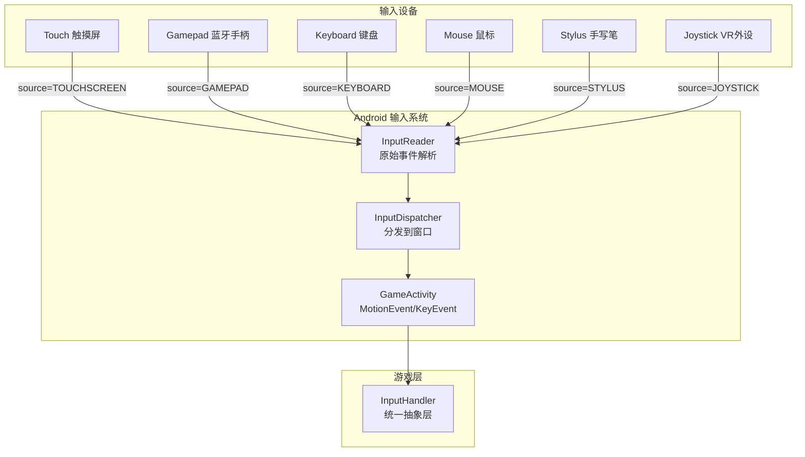
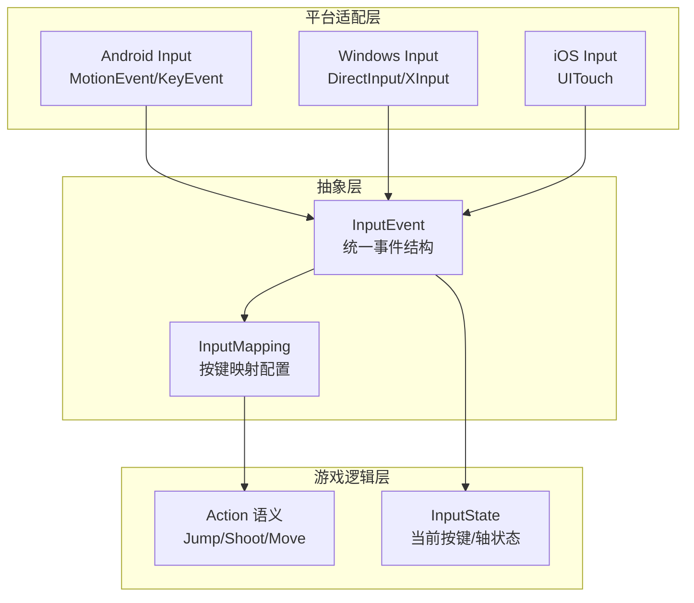
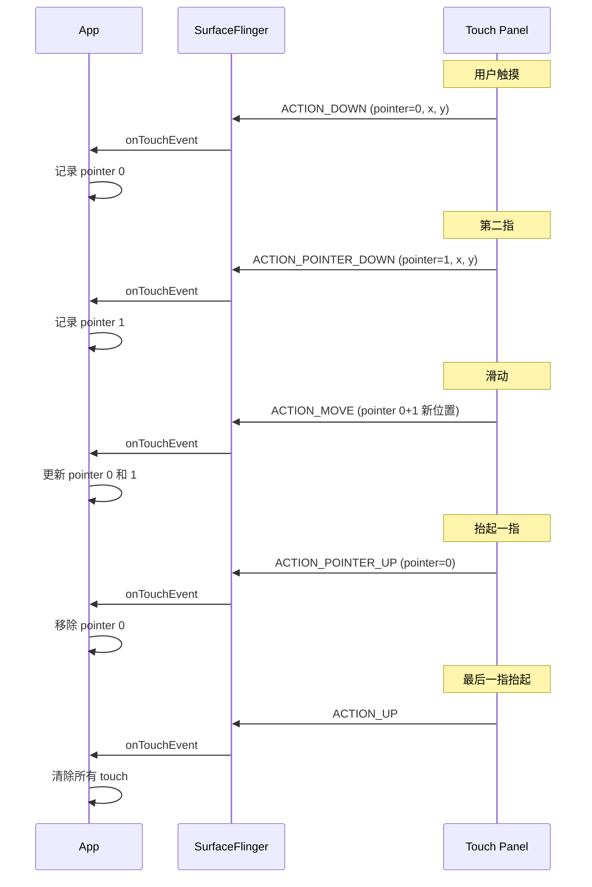
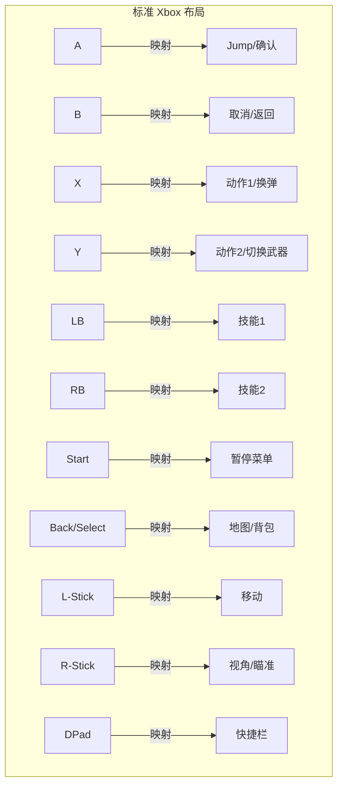
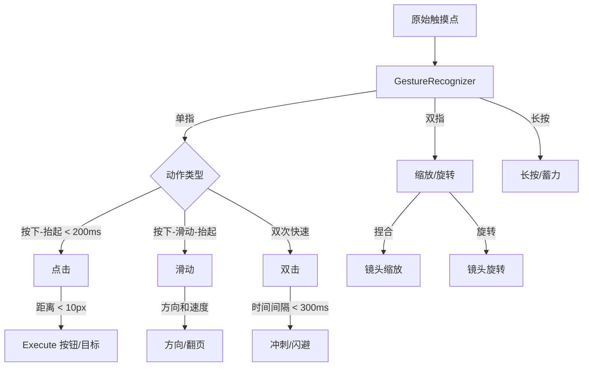

# Android 游戏输入系统标准

> 行业标准参考：Android Input System Architecture、GameActivity Input Guide、GDK 输入规范

---

## 1. 输入源分类



## 2. 输入抽象层设计

### 推荐层次



### 统一事件结构

```yaml
InputEvent:
  type:      TOUCH_DOWN | TOUCH_MOVE | TOUCH_UP | KEY_DOWN | KEY_UP | AXIS
  timestamp: int64           # 硬件时间戳
  device_id: int             # 输入设备 ID
  source:    TOUCHSCREEN | GAMEPAD | KEYBOARD | MOUSE

  # 触摸事件
  touch_id:  int             # 手指追踪 ID
  position:  vec2            # 归一化坐标 [0,1]

  # 按键事件
  key_code:  KeyCode         # 抽象按键码

  # 轴事件
  axis_values: map<Axis, float>  # 左右摇杆/扳机
```

## 3. 触摸输入处理

### 多点触控追踪



### 触摸事件过滤 (GameActivity)

```cpp
// 仅处理触摸和手柄事件
bool motion_event_filter(const GameActivityMotionEvent* event) {
    auto sourceClass = event->source & AINPUT_SOURCE_CLASS_MASK;
    return (sourceClass == AINPUT_SOURCE_CLASS_POINTER ||
            sourceClass == AINPUT_SOURCE_CLASS_JOYSTICK);
    // 过滤: 鼠标副按键/特殊设备
}
```

## 4. 手柄支持标准

### 按键映射规范



### 手柄检测与提示

```yaml
连接状态:
  - 首次连接: 显示 "手柄已连接" toast
  - 断开: 暂停游戏，显示 "手柄已断开"
  - 重连: 恢复

按键提示:
  - 检测到 Xbox 手柄 → 显示 ABXY
  - 检测到 PS 手柄 → 显示 ○×□△
  - 检测到 Switch 手柄 → 显示 BAYX
  - 未检测到 → 显示 UI 按钮 + 文字

检测方法:
  - InputDevice.getName() 包含 "Xbox" / "PLAYSTATION" / "Nintendo"
  - 厂商 VID 匹配
```

## 5. 键盘输入

### 标准游戏按键布局 (PC + Android)

```
WASD:  移动 (方向)
Space: 跳跃/确认
E:     交互
F:     全屏
Tab:   地图/背包
Esc:   暂停/取消
1-5:   快捷栏
R:     重新加载
Shift: 奔跑/加速
Ctrl:  下蹲/慢走
```

## 6. 输入延迟规格

### 端到端延迟预算

```mermaid
flowchart LR
    A[物理触摸] -->|~2ms| B[触摸控制器<br/>硬件采样]
    B -->|~1ms| C[驱动程序]
    C -->|~4ms| D[InputReader]
    D -->|~1ms| E[InputDispatcher]
    E -->|~3ms| F[App 接收]
    F -->|~1ms| G[InputHandler]
    G -->|更新| H[游戏状态]
    H -->|渲染| I[帧缓冲]
    I -->|~16ms| J[屏幕显示]
    J -->|[单手到眼]| K[用户感知]

    note right of K: 总延迟 ≈ 28ms
    note right of H: 触控到像素: ~9ms
```

```
触摸到像素延迟标准:
  Elite:  < 30ms  (竞技射击/FPS)
  Good:   30-50ms (动作游戏)
  Fair:   50-80ms (RPG/策略)
  Poor:   > 80ms  (用户明显感知卡顿)
```

## 7. 手势系统

### 标准手势识别



### 手势阈值规范

```
点击:
  maxDuration:     200ms
  maxMovement:     10px
  双击间隔:        ≤ 300ms

滑动:
  minDistance:     30px
  maxDuration:     500ms
  方向锁定:        abs(dx) > abs(dy) × 1.5

长按:
  minDuration:     500ms
  maxMovement:     15px

缩放:
  minSpanDelta:    20px
  trigger:         双指间距变化
```
