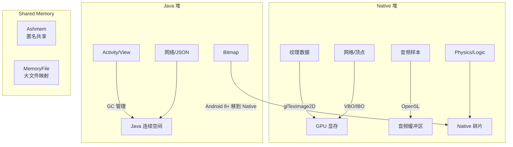
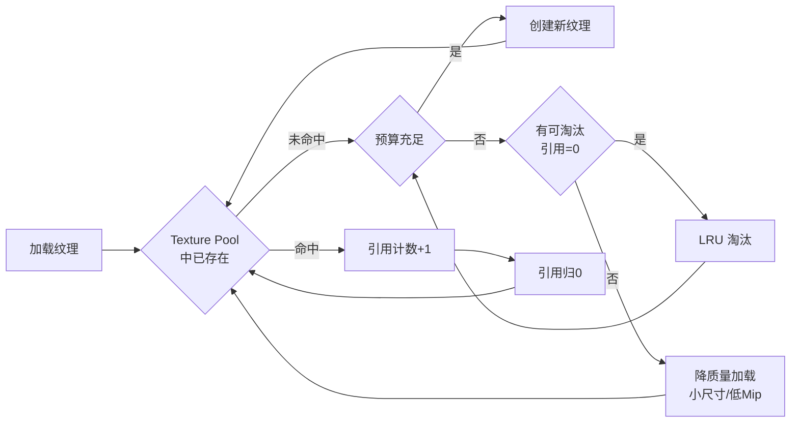
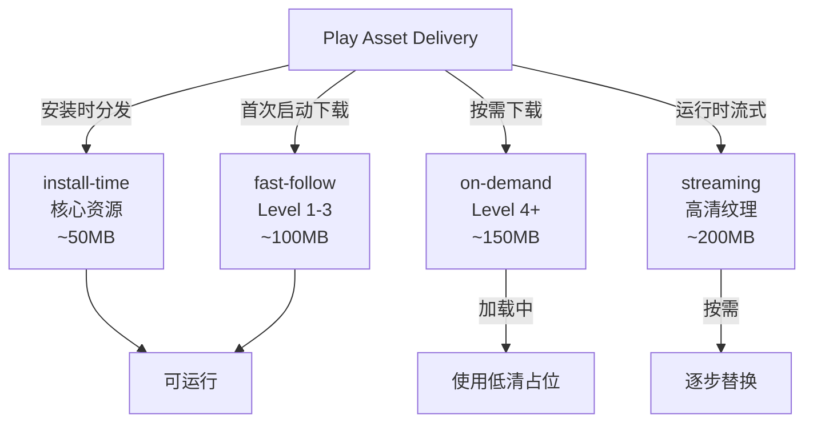
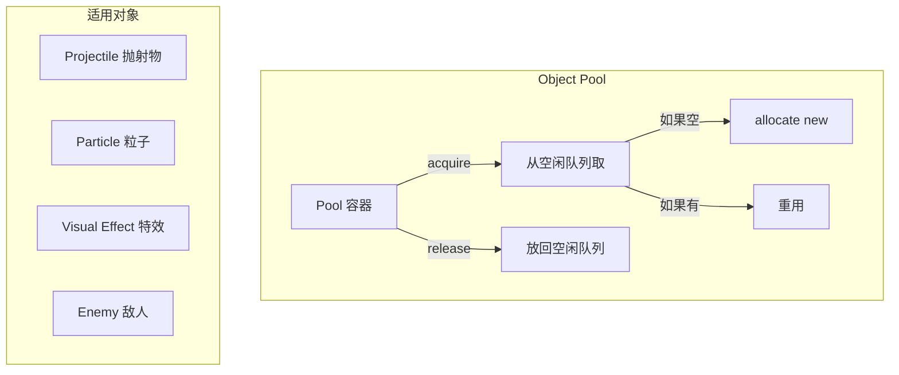
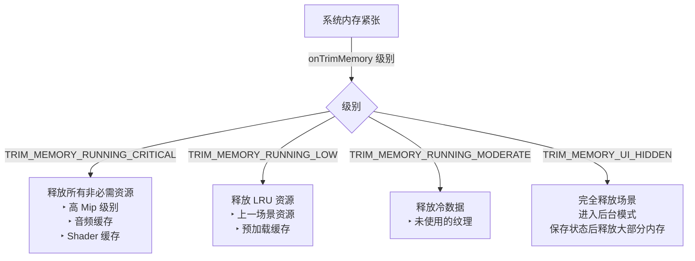

# Android 游戏内存与资源管理标准

> 行业标准参考：Android Memory Management、NDK 内存指南、Google Play 资源规范

---

## 1. 内存架构模型



### Android 内存分配演进

```
Android 版本        Bitmap         Large Objects     GC 行为
API 26 (8.0):      NativeHeap       NativeHeap       Concurrent
API 29 (10):       NativeHeap       NativeHeap       Concurrent + Compaction
API 31 (12):       NativeHeap       NativeHeap       Low Pause (<= 2ms)
API 34 (14):       NativeHeap       NativeHeap       可配置 GC 模式

核心结论:
  - Bitmap 已从 Java Heap 移出，大纹理无 GC 压力
  - 但大量小对象 (Java) 仍需关注 GC
  - 推荐使用 Native (C++) 管理游戏内存
```

## 2. 纹理内存管理

### 纹理内存预算

```
纹理内存 = 宽度 × 高度 × 像素字节 × Mip 链系数

格式内存计算:
  RGBA8888:  w × h × 4          bytes
  ETC2:      w × h × 0.5        bytes (= 4:1)
  ASTC 4x4:  w × h × 0.5        bytes (= 4:1)
  ASTC 6x6:  w × h × 0.22       bytes (= 9:1)
  ASTC 8x8:  w × h × 0.125      bytes (= 16:1)

Mip 链系数:
  Mip Levels = floor(log2(max(w, h))) + 1
  完整 Mip:  总内存 ≈ 1.33 × base_level  (几何级数 1 + 1/4 + 1/16 + ...)
```

### 纹理池化策略



## 3. 资源打包标准

### APK 结构建议

```
app.apk
├── lib/
│   ├── arm64-v8a/libgame.so
│   ├── armeabi-v7a/libgame.so
│   └── x86_64/libgame.so       # 可选：仅模拟器
├── assets/
│   ├── textures/
│   │   ├── scene1.astc          # ASTC 纹理图集
│   │   └── ui.rgba              # UI 纹理 (uncompressed)
│   ├── models/
│   │   └── characters.glb       # glTF 模型
│   ├── shaders/
│   │   └── core.spv             # SPIR-V Shader
│   └── config/
│       └── game_settings.json   # 运行时配置
└── res/
    └── raw/
        ├── bgm.ogg              # 背景音乐
        └── sfx_pack.ogg         # 音效组合文件
```

### Play Asset Delivery 策略



## 4. 对象池模式



```cpp
// 标准对象池接口
template<typename T>
class ObjectPool {
    std::vector<T> pool_;       // 连续内存
    std::vector<size_t> free_;  // 空闲索引栈

    T* acquire() {
        if (free_.empty()) {
            pool_.emplace_back();
            return &pool_.back();
        }
        auto idx = free_.back();
        free_.pop_back();
        return &pool_[idx];
    }

    void release(T* obj) {
        auto idx = obj - pool_.data();
        free_.push_back(idx);
    }
};
```

## 5. Android onTrimMemory 响应



## 6. Shader 缓存策略

### Shader 编译卡顿问题

```mermaid
xychart-beta
    title "Shader 编译时间分布"
    x-axis ["首次", "缓存后", "驱动更新"]
    y-axis "编译耗时 (ms)" 0 --> 300
    bar [280, 5, 260]
    bar [250, 3, 240]
    bar [200, 2, 200]
```



### 缓存策略

```
1. 离线编译
   - 使用 Android GPU Inspector 收集机型 Shader 缓存
   - 打包时包含常见 GPU 的缓存

2. 运行时缓存
   - glGetProgramBinary → 存到 filesDir
   - 下次启动直接 glProgramBinary 加载

3. 后台编译
   - 首次编译在 loading 界面完成
   - 场景切换时预变异

4. 回退方案
   - 简单备用 Shader (无特效)
   - 渐进式特效开启
```

## 7. 资源引用计数

```yaml
资源生命周期策略:
  强引用:   游戏中正在使用 → 不可卸载
  弱引用:   引用计数为 0 → LRU 候选
  预加载:   提前 3 秒开始加载 → 进入温区
  流式:     距离阈值触发 → 逐步加载高 Mip

引用计数规则:
  场景加载:       +1
  场景活跃:       ≥1
  场景卸载:       -1 (计数归 0 → 可淘汰)
  特效播放:       +1 (临时)
  特效结束:       -1

注意:
  - 避免循环引用 (使用 weak_ptr)
  - 引用图定期巡检 (每 10s 检查孤立资源)
```
