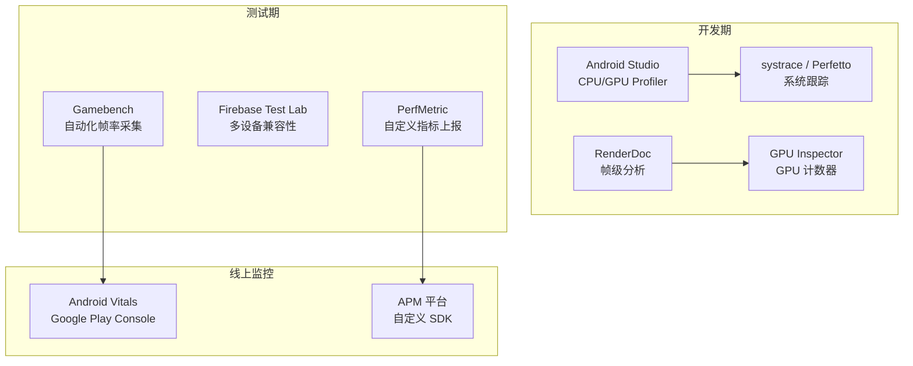
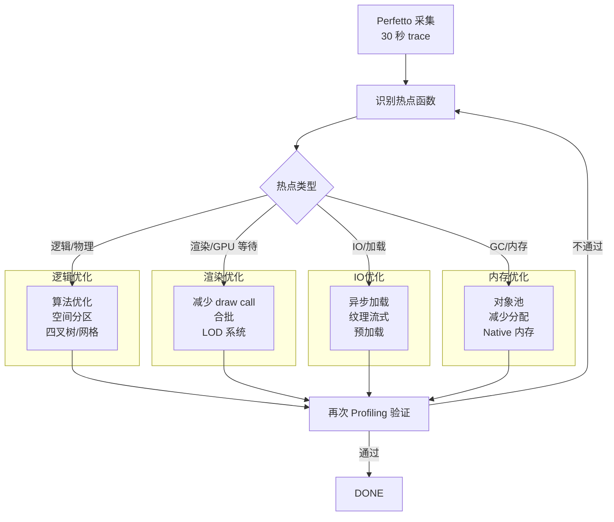
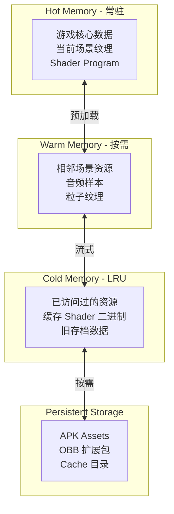
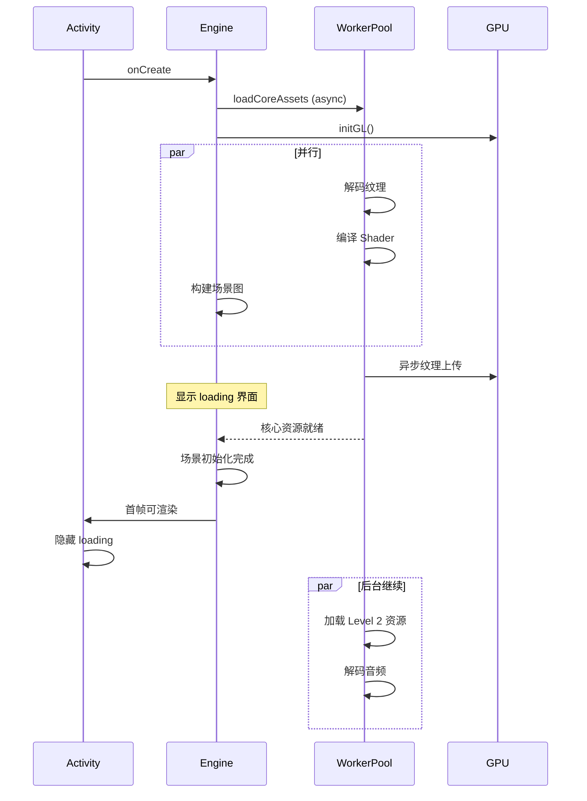

# Android 游戏性能基准与优化标准

> 行业标准参考：Google Android Performance Guide、Gamebench 基准、Android Vitals

---

## 1. 性能目标

### 帧率标准

| 设备等级 | 目标 FPS | 最低 FPS | 设备范围 |
|---------|---------|---------|---------|
| **旗舰** | 60 (可 90/120) | 45 | Snapdragon 8+ Gen, Dimensity 9000+ |
| **中端** | 60 (30 保底) | 30 | Snapdragon 7/6 系列, Dimensity 7000 |
| **入门** | 30 | 25 | Snapdragon 4 系列, Helio G 系列 |
| **低端** | 25 | 20 | 老款/低功耗设备 |

### Android Vitals 阈值

```
ANR 率:                < 0.1%  (每 1000 次启动)
崩溃率:                < 0.1%  (每 1000 次启动)
卡顿率 (janky frames): < 5%    (60fps 下 > 16.67ms)
冻结帧:                 < 0.1%  (> 700ms 无帧)
启动时间:               < 5s     (冷启动到首帧)
包体大小:               < 200MB  (APK + OBB)
```

## 2. 性能分析工具链



## 3. CPU 优化

### 热点分析流程



### CPU 优化清单

```
1. 减少 ALLOCATIONS
   - 每帧避免 new/delete
   - 使用对象池 (Pool pattern)
   - 固定容量容器 (避免 resize)
   - 使用 vector.reserve() 预分配

2. 缓存友好
   - 连续内存布局 (SOA 优于 AOS)
   - 避免虚函数调用 (热点函数)
   - 预取数据 (__builtin_prefetch)

3. 并行化
   - 物理独立线程
   - 异步资源加载
   - 渲染线程与逻辑线程分离

4. 数学优化
   - 预计算代替运行计算
   - SSE/NEON SIMD 指令
   - 定点数代替浮点 (低端 GPU)
```

## 4. GPU 优化

### 渲染优化金字塔

```mermaid
flowchart TB
    subgraph 顶部 (最高收益)
        L1[减少 Overdraw<br/>→ 最小化透明混合<br/>→ 使用 HW 遮挡查询]
    end

    subgraph 中层
        L2[减少 Draw Call<br/>→ 静态合批<br/>→ 纹理图集]
        L3[减少状态切换<br/>→ 排序 Draw Call<br/>→ 缓存 Pipeline]
    end

    subgraph 基础
        L4[纹理格式<br/>→ ASTC/ETC2<br/>→ 适当 Mip 级别]
        L5[Shader 复杂度<br/>→ 精度控制<br/>→ 避免动态分支]
    end
```

### GPU 指标监控

| 指标 | 正常 | 警告 | 严重 |
|------|------|------|------|
| GPU 利用率 | < 70% | 70-90% | > 90% |
| 顶点吞吐 | < 50M/s | 50-100M/s | > 100M/s |
| 像素填充率 | < 2 GPixel/s | 2-4 GPixel/s | > 4 GPixel/s |
| 纹理带宽 | < 5 GB/s | 5-15 GB/s | > 15 GB/s |
| Draw Calls | < 200 | 200-500 | > 500 |

## 5. 内存标准

### 设备内存分级

| 设备等级 | 总内存 | 游戏可用 | 推荐使用上限 |
|---------|--------|---------|------------|
| 低端 | 2-3 GB | ~500 MB | 纹理: 200MB, 几何: 50MB |
| 中端 | 4-6 GB | ~1.2 GB | 纹理: 500MB, 几何: 100MB |
| 高端 | 8-12 GB | ~3 GB | 纹理: 1GB, 几何: 300MB |
| 旗舰 | 12-16 GB | ~5 GB | 纹理: 2GB, 几何: 500MB |

### 分层内存管理



## 6. 功耗优化

### 功耗等级

```
Level 0 (空闲):   ~50mW     → 停止渲染，仅传感器
Level 1 (低负载):  ~200mW    → 30fps, 降分辨率
Level 2 (中等):    ~500mW    → 60fps, 标准品质
Level 3 (高负载):  ~1.5W     → 60fps, 最高品质
Level 4 (极限):    >3W       → 仅在充电/散热良好时

目标:
  平均功耗 < 1W (< 2W 峰值)
  电池续航: > 3 小时持续游戏
```

### 功耗优化策略

```
1. CPU/GPU 频率调节
   - 使用 android.os.PowerManager API
   - 了解 throttling 触发阈值 (通常 40-45°C)

2. 渲染频率调节
   - 静态场景 → 降低帧率至 30fps
   - 动效场景 → 60fps
   - 战斗激烈 → 保持 60fps, 降低品质

3. 网络优化
   - 批量发送 (非每帧)
   - TCP 保活间隔适当 (5-10min)
   - 避免长连接不活动

4. 传感器优化
   - 关闭非必要传感器
   - 降低采样率 (非游戏时)
```

## 7. 加载优化

### 启动时间预算

```
冷启动总预算: 5s

Total: 5000ms
  ├─ Activity init:        200ms
  ├─ Engine bootstrap:     500ms
  ├─ Asset index load:     300ms
  ├─ Core Shader compile:  800ms
  ├─ Main scene load:      1500ms
  ├─ First frame render:   500ms
  └─ Remaining assets:     1200ms (async)
```

### 异步加载架构


