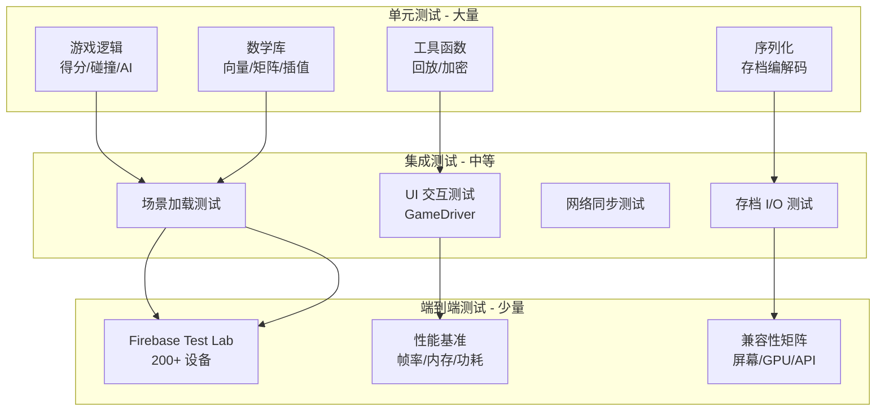
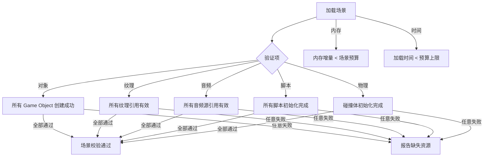
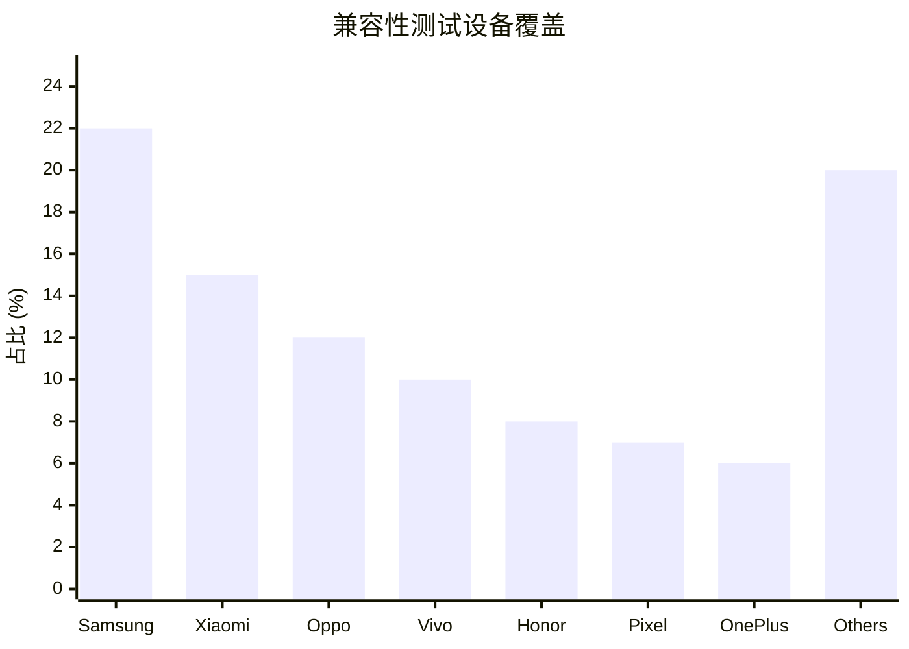

# Android 游戏测试与质量保障标准

> 行业标准参考：Google Testing on the Toilet、Android Testing Guide、Game QA 最佳实践

---

## 1. 测试金字塔



## 2. 单元测试

### C++ Native 测试 (Google Test)

```yaml
框架: Google Test (gtest)
CMake 集成:
  find_package(GTest REQUIRED)
  target_link_libraries(gtest gtest_main)

运行:
  - Host:    直接在开发机运行 (快速验证)
  - Device:  cross-compile 到 Android 运行

目录规范:
  src/main/cpp/tests/              # Native 测试
  app/src/test/java/                # Java/Kotlin 单元测试
```

### 测试覆盖目标

```
覆盖类型    目标        重点模块
行覆盖      ≥ 80%      游戏逻辑、数学库
分支覆盖    ≥ 70%      状态机、AI 决策
异常覆盖    ≥ 50%      网络/存档 IO

重点测试模块:
  - 碰撞检测: 边界情况、角落碰撞
  - 得分系统: 溢出、负值、连击
  - 存档系统: 损坏数据、版本迁移
  - 状态机:   所有合法/非法转换
```

## 3. 集成测试

### 场景加载测试



### Android GameDriver 自动化

```kotlin
// 使用 GameDriver (AndroidX Test) 自动化 UI 交互
@RunWith(AndroidJUnit4::class)
class GameDriverTest {
    @Test
    fun testStartButton() {
        GameDriver.findElement(By.text("START"))
            .also { assertNotNull(it) }
            ?.click()

        // 验证进入游戏状态
        GameDriver.waitFor(By.text("PLAYING"), 2000)
        assertNotNull(GameDriver.findElement(By.text("PAUSE")))
    }

    @Test
    fun testPauseResume() {
        // 点击 START
        GameDriver.findElement(By.text("START"))?.click()
        Thread.sleep(500)

        // 暂停
        GameDriver.findElement(By.text("PAUSE"))?.click()
        assertNotNull(GameDriver.findElement(By.text("RESUME")))

        // 继续
        GameDriver.findElement(By.text("RESUME"))?.click()
        assertNotNull(GameDriver.findElement(By.text("PAUSE")))
    }
}
```

## 4. 性能测试

### 基准场景定义

```yaml
标准基准场景:
  idle:               空闲 60 秒，无交互
  gameplay_basic:     基础游戏操作 120 秒
  gameplay_intense:   高强度战斗/特效 60 秒
  scene_transition:   场景切换 10 次
  loading_warm:       热启动 (从切回)
  loading_cold:       冷启动 (首次安装)

采集指标:
  FPS:                平均/最低/P1/P99
  FrameTime:          平均/最慢帧
  Jank:               > 16.67ms 帧占比
  Frozen:             > 700ms 帧数
  Memory:             PSS/Native/Graphics/Total
  Power:              mAh 或 电流
  Temperature:        CPU/GPU/Battery
  LoadingTime:        关键场景加载耗时
```

### 性能回归阈值

```
      指标              警告              失败
  ─────────────────────────────────────────────
  Avg FPS             下降 > 5%        下降 > 15%
  P1 FrameTime        > 50ms           > 100ms
  Janky frames        > 8%             > 15%
  Memory (total)      +20% baseline    > 设备 80%
  Loading time        +30%             +100%
  Temperature         +5°C             +10°C (触发降频)
```

## 5. 兼容性测试

### 设备矩阵



### 测试设备选择策略

```
旗舰 (25%):
  Samsung S25 Ultra, Pixel 10 Pro, OnePlus 13
  测试: 最高画质、120fps、Vulkan

中端 (50%):
  Samsung A55, Redmi Note 15, Oppo Reno 15
  测试: 标准画质、60fps、GLES 3.2

入门 (25%):
  Samsung A15, Redmi 14C
  测试: 低画质、30fps、GLES 3.0

特殊测试:
  低内存设备 (4GB):   内存压力
  折叠屏:             屏幕适配
  Android Go:         超低端兼容
  平板:               布局适配
```

## 6. 性能监控 (线上)

### Android Vitals 集成

```yaml
Play Console 自动采集:
  - ANR 率
  - 崩溃率
  - 启动时间
  - 帧率 (Android 12+)
  - 卡顿率

自定义上报:
  指标:
    - 场景加载耗时
    - 内存峰值 (Native/Graphics)
    - 平均帧率
    - 渲染品质设置
    - 设备型号/GPU/API Level

  采样率:
    - 新版本发布: 100% 设备
    - 稳定版本:   5% 设备随机采样
```

### 崩溃符号化

```bash
# Native 崩溃符号化
# 1. 保存每次构建的 symbols.zip
# 2. 上传到 Play Console
# 3. 或本地符号化:
ndk-stack -sym app/build/intermediates/merged_native_libs/release/ \
          -dump crash.dump

# 自动化: CI 中自动上传 mapping + symbols
- uses: google/play-upload-mapping@v1
  with:
    mapping: app/build/outputs/mapping/release/mapping.txt
    symbols: app/build/intermediates/merged_native_libs/release/out/
```

## 7. 测试流程规范

### 提测检查清单

```
开发阶段:
  □ 新增模块/函数有 GTEST/JUnit 测试
  □ 测试在 Linux/Mac 可编译运行
  □ CI 绿色通过

提测前:
  □ 单元测试通过率 100%
  □ lint/clang-tidy 无新增 warning
  □ Android Lint 无新增 error
  □ 手动运行游戏 5 分钟无崩溃

提测:
  □ 构建 APK 上传 QA
  □ release note 标注改动范围
  □ 标注需要回归测试的场景
  □ 提供测试设备兼容性矩阵

上线前:
  □ Firebase Test Lab 通过 (top 50 设备)
  □ 性能基准无退化
  □ Android Vitals 阈值检查
  □ 灰度发布 1% 观察 24h
```
