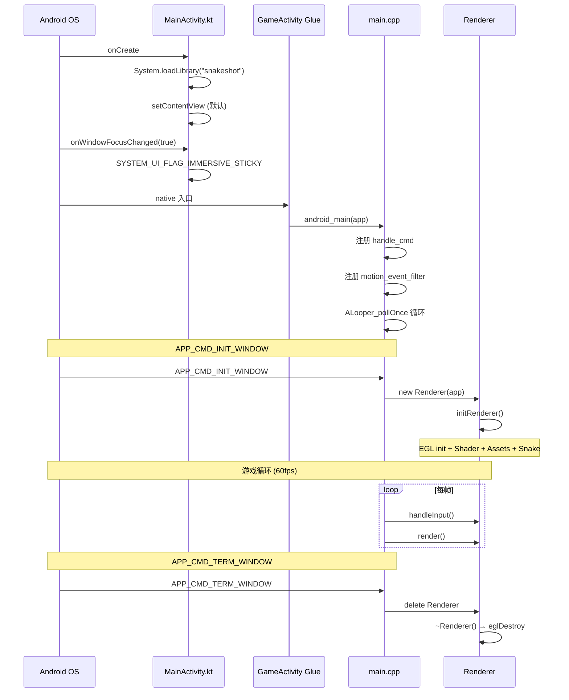
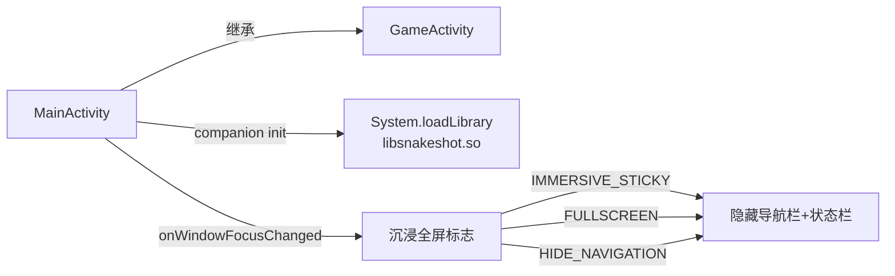
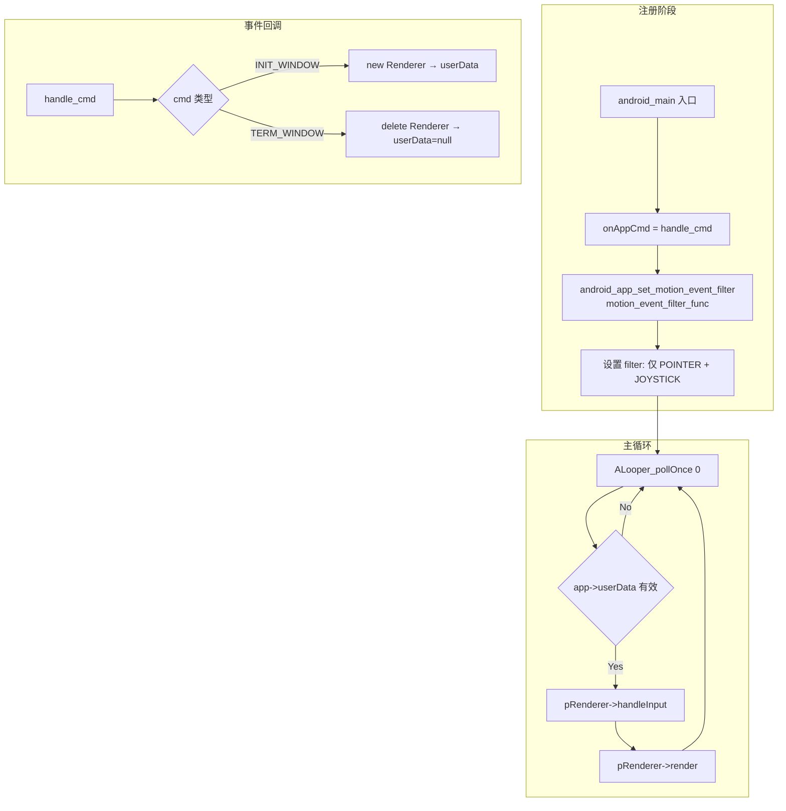
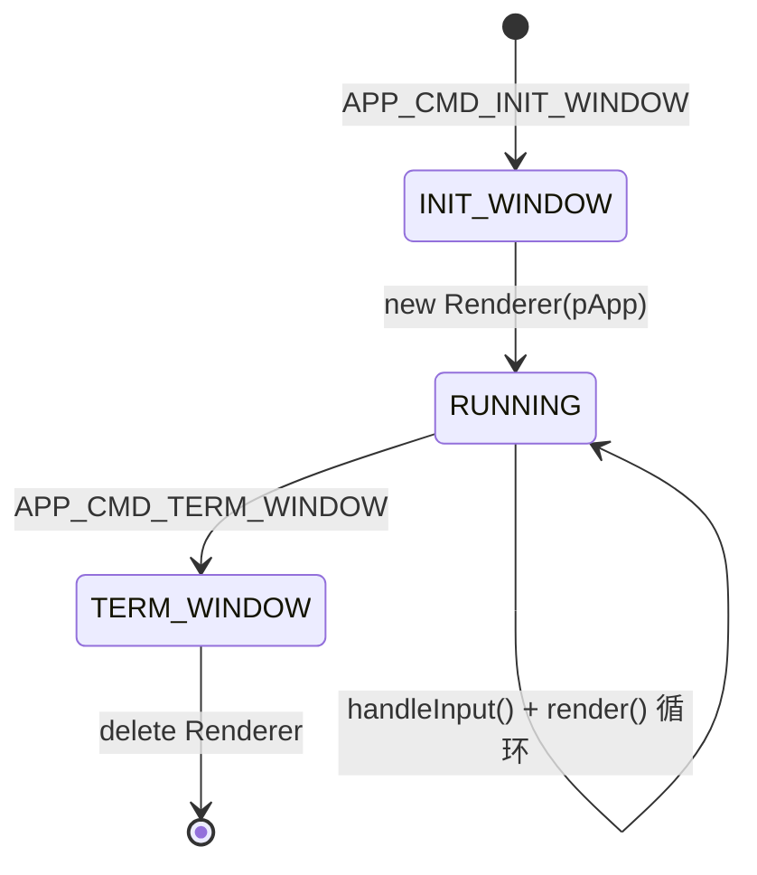

# SnakeShot Kotlin↔C++ 接口规格

**版本:** v2
**状态:** draft
**负责人:** SA

---

## 1. 概述

SnakeShot 使用 Android GameActivity 框架实现 Kotlin ↔ C++ 交互。入口函数由 GameActivity glue 代码自动映射到 `android_main`，无需手动 JNI 注册。

## 2. 生命周期映射



## 3. Kotlin 层职责



```
沉浸标志组合:
  SYSTEM_UI_FLAG_IMMERSIVE_STICKY
  | SYSTEM_UI_FLAG_FULLSCREEN
  | SYSTEM_UI_FLAG_HIDE_NAVIGATION
  | SYSTEM_UI_FLAG_LAYOUT_STABLE
  | SYSTEM_UI_FLAG_LAYOUT_HIDE_NAVIGATION
  | SYSTEM_UI_FLAG_LAYOUT_FULLSCREEN
```

## 4. 原生入口流程



## 5. 输入事件管道路径

```mermaid
flowchart LR
    subgraph Android 事件
        ME[MotionEvent<br/>ACTION_DOWN]
    end

    subgraph GameActivity API
        BUF[android_app_swap_input_buffers]
        CLEAR[android_app_clear_motion_events]
    end

    subgraph 坐标转换
        NX[x / width → nx [0,1]]
        NY[1 - y/height → ny [0,1]]
    end

    subgraph 命中处理
        SPEED[速度控制命中检测<br/>MENU 状态]
        BTN[按钮命中检测<br/>所有状态]
        DIR[方向输入计算<br/>PLAYING 状态]
    end

    ME -->|motionEvents[i]| BUF
    BUF -->|extract x,y| NX
    BUF -->|extract x,y| NY
    NX --> handleButtonDown
    NY --> handleButtonDown
    handleButtonDown --> SPEED
    SPEED -->|未命中| BTN
    BTN -->|PLAYING 状态未命中按钮| DIR

    DIR -.-> BUF
    BUF --> CLEAR
```

### 坐标转换
```
nx = touchX / screenWidth         → [0, 1]
ny = 1.0 - touchY / screenHeight  → [0, 1], Y 轴翻转 (GL 坐标系)
```

### 事件过滤
```
允许: AINPUT_SOURCE_CLASS_POINTER  (触摸屏)
允许: AINPUT_SOURCE_CLASS_JOYSTICK (手柄)
拒绝: 其他设备 (键盘/鼠标 等)
```

## 6. 生命周期回调



```
APP_CMD_INIT_WINDOW:
  → pApp->userData = new Renderer(pApp)
  → Renderer 构造 = initRenderer() = EGL + Shader + Assets

APP_CMD_TERM_WINDOW:
  → delete (Renderer*)pApp->userData
  → ~Renderer 析构 = eglDestroyContext + eglDestroySurface + eglTerminate
```

## 7. 构建接口

```mermaid
flowchart TB
    subgraph Gradle
        GR[build.gradle.kts] -->|CMake 3.22.1| CMAKE[CMakeLists.txt]
        GR -->|prefab| GA[game-activity]
    end

    subgraph CMake
        CMAKE -->|add_library SHARED| LIB[libsnakeshot.so]
        CMAKE -->|find_library| DEPS[game-activity_static<br/>EGL | GLESv3 | jnigraphics<br/>android | log]
    end

    subgraph 源码编译
        LIB -->|编译单元| SRC[main.cpp<br/>Renderer.cpp<br/>Shader.cpp<br/>TextureAsset.cpp<br/>BitmapFont.cpp<br/>AndroidOut.cpp<br/>Utility.cpp]
    end
```

```
CMake 链接顺序:
  game-activity_static  → Android 原生活动支持
  EGL                   → 窗口系统接口
  GLESv3                → OpenGL ES 3.0
  jnigraphics           → Android 图形库 (AImageDecoder)
  android               → Android 基础库
  log                   → logcat 日志
```
