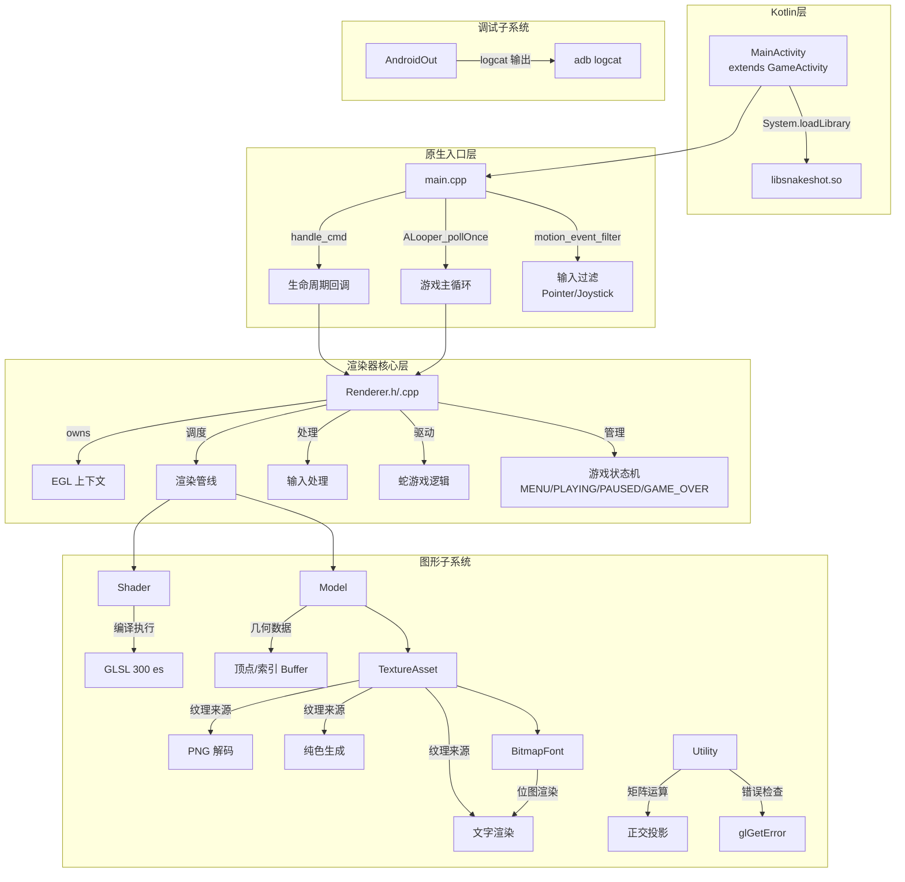
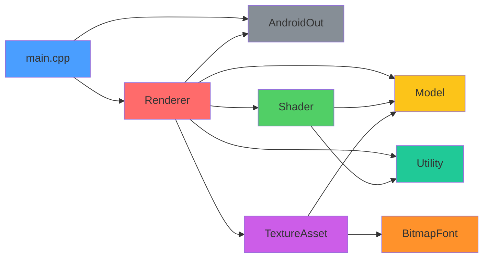
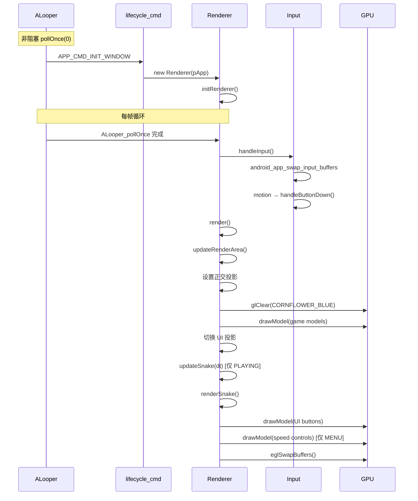
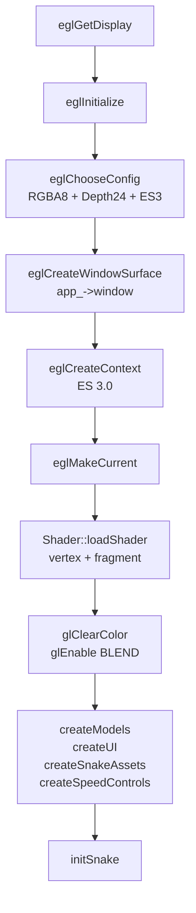
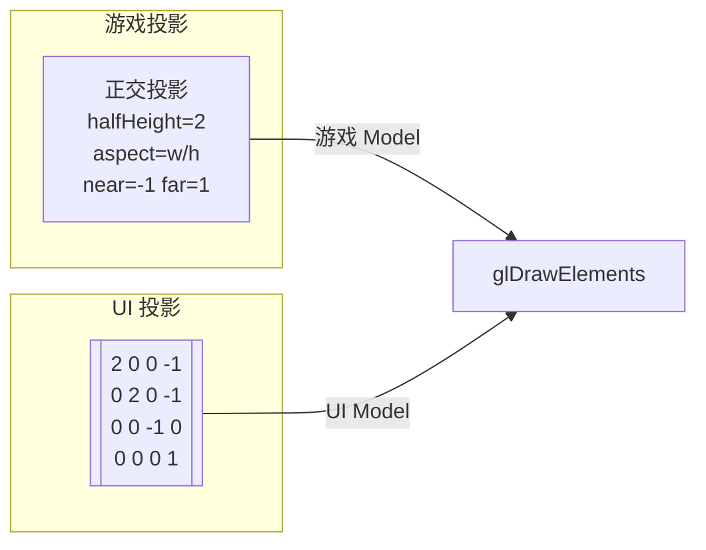
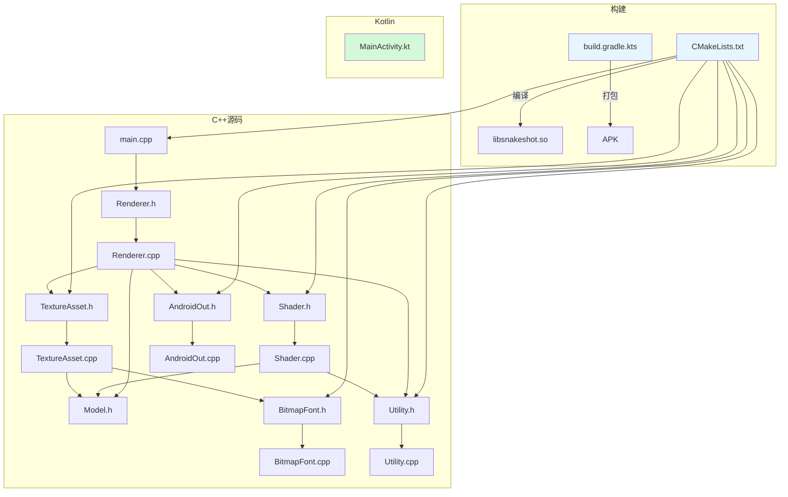

# SnakeShot 系统架构规格

**版本:** v2
**状态:** draft
**负责人:** SA

---

## 1. 概述

SnakeShot 是一款 Android 原生贪吃蛇游戏，使用 **GameActivity** + **OpenGL ES 3.0** 原生渲染，无 Android View 系统依赖。

### 设计目标
- 全屏沉浸式游戏体验
- 纯原生 C++ 渲染管线（60fps）
- 触摸输入驱动
- 无第三方游戏引擎依赖

## 2. 系统层次架构



## 3. 模块依赖关系



## 4. 模块职责速查

| 模块 | 文件 | 职责一句话 |
|------|------|-----------|
| **MainActivity** | `MainActivity.kt` | 加载 native 库 + 沉浸全屏标志 |
| **main** | `main.cpp` | ALooper 事件循环 + 生命周期回调分发 |
| **Renderer** | `Renderer.h/.cpp` | 核心：EGL/渲染/UI/蛇逻辑/输入 — 全部汇聚于此 |
| **Shader** | `Shader.h/.cpp` | GLSL 编译 + 通过 attrib pointer 绘制 Model |
| **Model** | `Model.h` | 顶点/索引/纹理 三元组容器 |
| **TextureAsset** | `TextureAsset.h/.cpp` | 三种纹理来源：PNG / 纯色 / 文字 |
| **BitmapFont** | `BitmapFont.h/.cpp` | 内嵌 96 字符 8×8 位图 → RGBA buffer |
| **Utility** | `Utility.h/.cpp` | GL 错误检查 + 正交矩阵构建 |
| **AndroidOut** | `AndroidOut.h/.cpp` | `std::ostream` → `__android_log_print` |

## 5. 数据流

### 主循环 (60fps)



### EGL 初始化流程



## 6. 投影矩阵切换



### 矩阵结构 (column-major)
```
游戏投影: buildOrthographicMatrix(2.0, width/height, -1.0, 1.0)
UI 投影:  [2.0] [0]   [0]  [-1.0]
          [0]   [2.0] [0]  [-1.0]
          [0]   [0]   [-1] [0]
          [0]   [0]   [0]  [1.0]
```

## 7. 渲染管线 (单帧)

```mermaid
flowchart TB
    A[updateRenderArea<br/>尺寸变化？更新 viewport+投影] --> B[切换游戏投影]
    B --> C[glClear COLOR_BUFFER_BIT]
    C --> D[for each model in models_<br/>→ shader->drawModel]
    D --> E[切换 UI 投影]
    E --> F{gameState == PLAYING?}
    F -->|Yes| G[updateSnake(dt)]
    F -->|No| H[跳过]
    G --> H
    H --> I{snakeSegments_ 非空}
    I -->|Yes| J[renderSnake<br/>网格背景→食物→蛇身]
    I -->|No| K[跳过]
    J --> K
    K --> L[for each button<br/>visibleIn==gameState<br/>→ drawModel]
    L --> M{gameState == MENU?}
    M -->|Yes| N[draw speed controls]
    M -->|No| O[跳过]
    N --> O
    O --> P[eglSwapBuffers]
```

## 8. GLSL Shader 概要

```
Vertex Shader (#version 300 es)
  Input:  vec3 inPosition, vec2 inUV
  Output: vec2 fragUV
  Uniform: mat4 uProjection
  → gl_Position = uProjection * vec4(inPosition, 1.0)

Fragment Shader (#version 300 es, mediump float)
  Input:  vec2 fragUV
  Uniform: sampler2D uTexture
  → outColor = texture(uTexture, fragUV)
```

## 9. 构建配置

```
Build System: Gradle + CMake 3.22.1
Android SDK: API 36
NDK ABIs: armeabi-v7a | arm64-v8a | x86 | x86_64
Native Libs: game-activity_static | EGL | GLESv3 | jnigraphics | android | log
Kotlin: androidx.games-activity:4.0.0
```

## 10. 文件关系图


