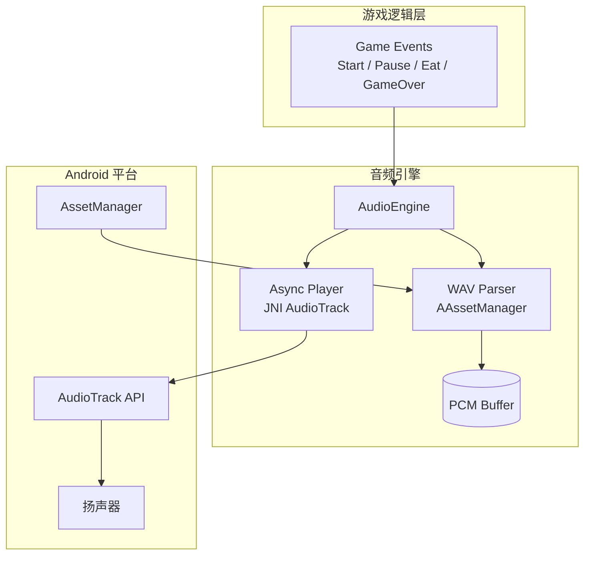
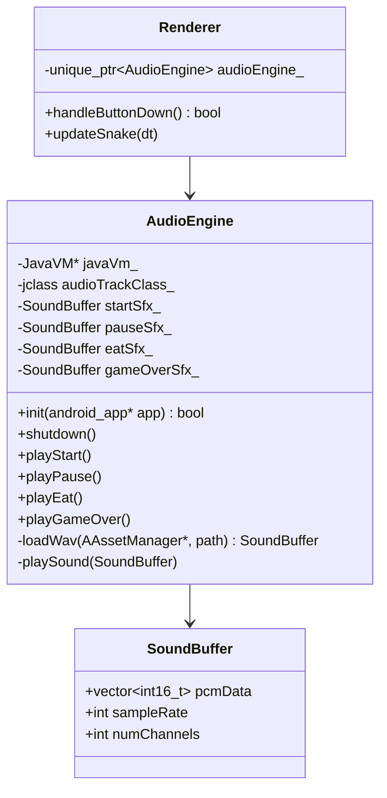
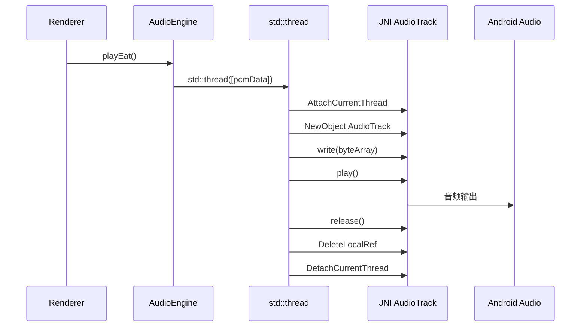

# SnakeShot 音效系统规格

**版本:** v1
**状态:** draft
**负责人:** DE

---

## 1. 概述

SnakeShot 游戏音效系统，在关键游戏事件触发时播放对应 WAV 音效，使用 Android `AudioTrack` API 通过 JNI 异步播放。

## 2. 系统架构



## 3. 类设计



## 4. 需求规格

### 4.1 游戏开始音效

**SHALL-001:** 当玩家从 MENU 界面点击 START 按钮时，系统应播放开始音效。

- **GWT:** Given 游戏处于 MENU 状态，When 玩家点击 START 按钮，Then 应触发 `playStart()` 且异步播放 `sfx_start.wav`。
- **GWT:** Given 玩家从 GAME_OVER 界面点击 AGAIN 按钮，When 游戏重新开始时，Then 不应触发开始音效（仅 MENU→PLAYING 触发）。

### 4.2 游戏暂停音效

**SHALL-002:** 当玩家在 PLAYING 状态点击 PAUSE 按钮时，系统应播放暂停音效。

- **GWT:** Given 游戏处于 PLAYING 状态，When 玩家点击 PAUSE 按钮，Then 应触发 `playPause()` 且异步播放 `sfx_pause.wav`。

### 4.3 吃食物音效

**SHALL-003:** 当蛇头移动到食物位置时，系统应播放吃食物音效。

- **GWT:** Given 蛇正在移动，When 蛇头坐标等于食物坐标，Then 应触发 `playEat()` 且异步播放 `sfx_eat.wav`。

### 4.4 Game Over 音效

**SHALL-004:** 当游戏因碰撞或玩家主动停止而结束时，系统应播放 Game Over 音效。

- **GWT:** Given 蛇正在移动，When 蛇头撞击墙壁或自身，Then 应触发 `playGameOver()` 且异步播放 `sfx_gameover.wav`。
- **GWT:** Given 游戏处于 PLAYING 状态，When 玩家点击 STOP 按钮，Then 应触发 `playGameOver()` 且异步播放 `sfx_gameover.wav`。

### 4.5 异步播放

**SHALL-005:** 音效播放不应阻塞主游戏渲染循环。

- **GWT:** Given 游戏正在渲染，When 音效触发播放，Then 播放应在后台线程进行，渲染帧率不受影响。

### 4.6 WAV 资源加载

**SHALL-006:** 系统应从 APK assets 目录加载 WAV 格式音效资源。

- **GWT:** Given 音频引擎初始化，When `init()` 被调用，Then 应从 assets 加载 `sfx_start.wav`、`sfx_pause.wav`、`sfx_eat.wav`、`sfx_gameover.wav` 四个文件。

## 5. 关键流程

### 5.1 音频播放时序



### 5.2 WAV 加载流程

```mermaid
flowchart LR
    A[AAssetManager_open] --> B[读取 WAV 头]
    B --> C{RIFF + WAVE?}
    C -->|否| D[返回空]
    C -->|是| E[解析 fmt chunk]
    E --> F{data chunk}
    F --> G[读取 PCM 数据]
    G --> H[{pcmData, sampleRate, channels}]
    H --> I[AAsset_close]
```

## 6. 追溯矩阵

| SHALL | 源文件 | 方法/触发点 | 测试用例 |
|-------|--------|------------|---------|
| SHALL-001 | Renderer.cpp:625-626 | `handleButtonDown` MENU→PLAYING | AU-01 |
| SHALL-002 | Renderer.cpp:627-628 | `handleButtonDown` PLAYING→PAUSED | AU-02 |
| SHALL-003 | Renderer.cpp:475-476 | `updateSnake` head==foodPos | AU-03 |
| SHALL-004 | Renderer.cpp:458-459, 466-467, 629 | `updateSnake` 碰撞 + STOP按钮 | AU-04, AU-05 |
| SHALL-005 | AudioEngine.cpp:196 | `std::thread` 异步播放 | AU-06 |
| SHALL-006 | AudioEngine.cpp:73-76 | `init` 加载 WAV | AU-07 |

## 7. 资源文件清单

| 文件 | 格式 | 采样率 | 时长 | 大小 |
|------|------|--------|------|------|
| `sfx_start.wav` | PCM 16-bit mono | 22050 Hz | ~0.5s | 22094 bytes |
| `sfx_pause.wav` | PCM 16-bit mono | 22050 Hz | ~0.3s | 13274 bytes |
| `sfx_eat.wav` | PCM 16-bit mono | 22050 Hz | ~0.15s | 6660 bytes |
| `sfx_gameover.wav` | PCM 16-bit mono | 22050 Hz | ~0.8s | 35324 bytes |
