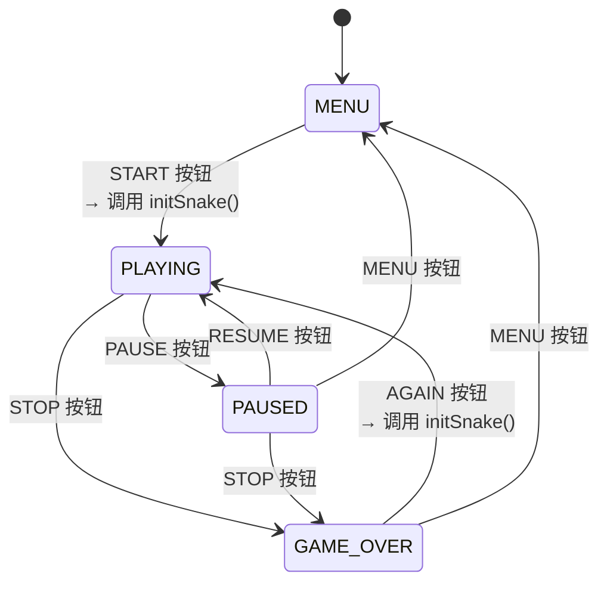
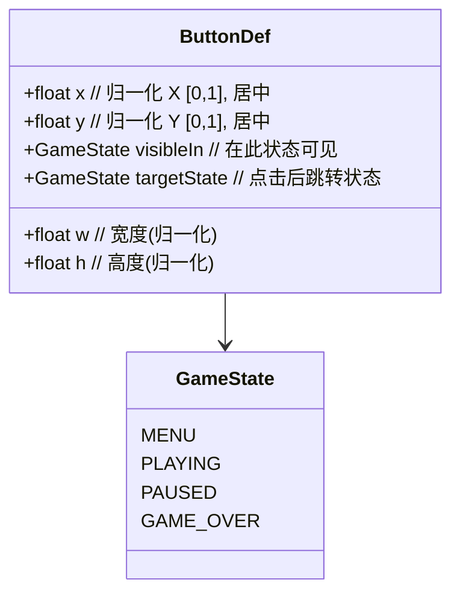
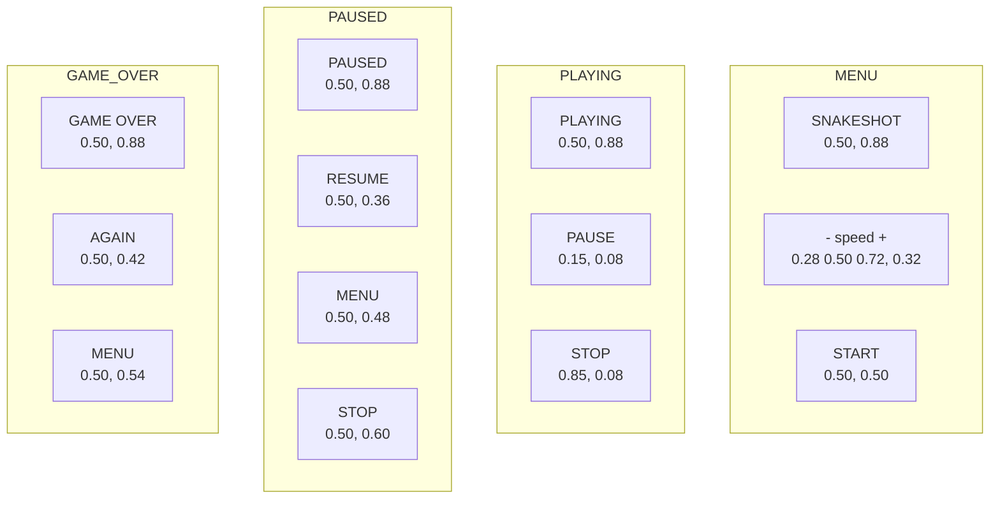
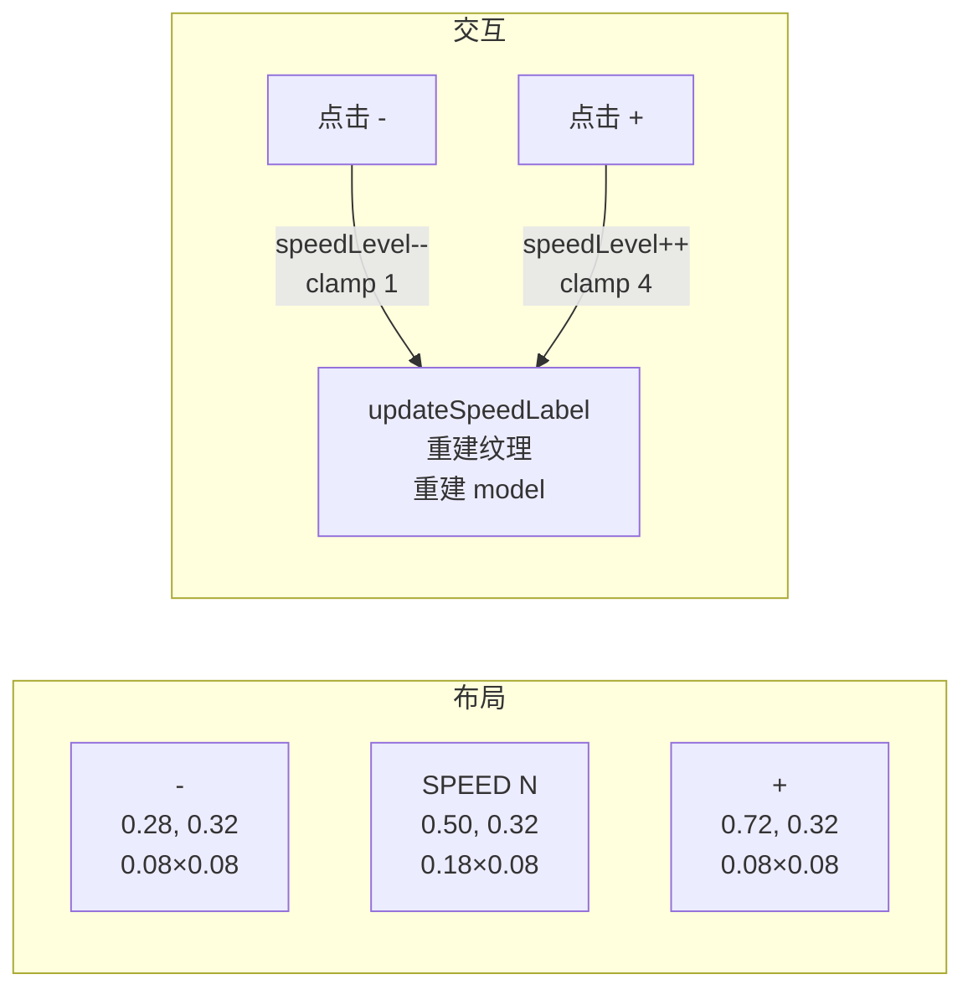

# SnakeShot UI/输入系统规格

**版本:** v3
**状态:** draft
**负责人:** UX

---

## 1. 概述

SnakeShot 的 UI 系统完全使用 OpenGL ES 3.0 原生渲染，通过纹理四边形实现按钮和标签。使用内嵌 8×8 位图字体渲染文字，无 Android View 系统依赖。

## 2. 游戏状态机



## 3. 按钮数据模型



### 按钮布局



### 完整按钮表

| 界面 | 文字 | 位置 (x,y) | 尺寸 (w×h) | 色值 | target |
|------|------|-----------|-----------|------|--------|
| MENU | SNAKESHOT | 0.50, 0.88 | 0.30×0.07 | `#333` | MENU |
| MENU | — | 0.28, 0.32 | 0.08×0.08 | `#444` | — |
| MENU | SPEED N | 0.50, 0.32 | 0.18×0.08 | `#333` | — |
| MENU | + | 0.72, 0.32 | 0.08×0.08 | `#444` | — |
| MENU | START | 0.50, 0.50 | 0.30×0.10 | `#4CAF50` | PLAYING |
| PLAYING | PLAYING | 0.50, 0.88 | 0.30×0.07 | `#333` | PLAYING |
| PLAYING | PAUSE | 0.15, 0.08 | 0.14×0.07 | `#9E9E9E` | PAUSED |
| PLAYING | STOP | 0.85, 0.08 | 0.14×0.07 | `#F44336` | GAME_OVER |
| PAUSED | PAUSED | 0.50, 0.88 | 0.30×0.07 | `#333` | PAUSED |
| PAUSED | RESUME | 0.50, 0.36 | 0.30×0.08 | `#FFC107` | PLAYING |
| PAUSED | MENU | 0.50, 0.48 | 0.30×0.08 | `#2196F3` | MENU |
| PAUSED | STOP | 0.50, 0.60 | 0.30×0.08 | `#F44336` | GAME_OVER |
| GAME_OVER | GAME OVER | 0.50, 0.88 | 0.30×0.07 | `#333` | GAME_OVER |
| GAME_OVER | AGAIN | 0.50, 0.42 | 0.30×0.08 | `#4CAF50` | PLAYING |
| GAME_OVER | MENU | 0.50, 0.54 | 0.30×0.08 | `#F44336` | MENU |

## 4. 按钮渲染机制

```mermaid
flowchart TB
    subgraph 纹理生成
        BTN[ButtonDef] --> STYLE[查找 ButtonStyle<br/>color + label]
        STYLE --> CT[TextureAsset::createText<br/>R, G, B, A, label, fontScale]
        CT --> BITMAP[BitmapFont::renderText<br/>→ RGBA pixel buffer]
        BITMAP --> TEX[glTexImage2D → GL_RGBA]
    end

    subgraph Model 构建
        BTN --> QUAD[计算四边形顶点]
        QUAD -->|UV y-flipped| VERT[Vertex 数组]
        VERT --> MODEL[Model(verts, idx, tex)]
    end

    subgraph 渲染
        RENDER[render 每帧] --> FILTER{btn.visibleIn == gameState?}
        FILTER -->|是| DRAW[shader->drawModel]
        FILTER -->|否| SKIP[跳过]
    end
```

### 纹理缩放
```
fontScale = max(2, min(4, width / 960))
  ≤960px  → 2
  960-1440 → 3
  ≥1440   → 4
```

## 5. 输入处理流程

```mermaid
flowchart TB
    INPUT[android_app_swap_input_buffers] --> EVENT{action type}
    EVENT -->|ACTION_DOWN| COORD[坐标转换<br/>nx = x/w<br/>ny = 1 - y/h]
    EVENT -->|ACTION_POINTER_DOWN| COORD
    EVENT -->|其他| DROP[丢弃]

    COORD --> handleButtonDown

    handleButtonDown --> STATE{gameState?}

    STATE -->|MENU| CHECK_SPEED{命中速度控制}
    CHECK_SPEED -->|"-" 区域 0.24-0.32, 0.28-0.36| DEC[speedLevel--<br/>clamp 1-4]
    CHECK_SPEED -->|"+" 区域 0.68-0.76, 0.28-0.36| INC[speedLevel++<br/>clamp 1-4]
    CHECK_SPEED -->|未命中| BTN_CHECK{命中按钮}

    STATE -->|PLAYING| BTN_CHECK
    STATE -->|PAUSED| BTN_CHECK
    STATE -->|GAME_OVER| BTN_CHECK

    BTN_CHECK -->|命中 visibleIn 按钮| ACTION[执行按钮动作]
    ACTION -->|target == PLAYING<br/>来源 MENU/GAME_OVER| INIT[initSnake()]
    ACTION -->|其他| SWITCH[gameState = targetState]

    BTN_CHECK -->|PLAYING 未命中| DIR[方向输入]

    DEC --> UPD[updateSpeedLabel]
    INC --> UPD
    UPD --> DONE[return true]

    INIT --> SWITCH

    SWITCH --> DONE
    DIR --> DONE

    DONE --> CLEAR[android_app_clear_motion_events]
```

## 6. 速度控制 (MENU 界面)



### 速度等级
```
Level 1: 0.30s → SPEED 1
Level 2: 0.20s → SPEED 2  (默认)
Level 3: 0.12s → SPEED 3
Level 4: 0.07s → SPEED 4
```

### 速度控制命中区域 (硬编码)
```
"-" 按钮: nx ∈ [0.24, 0.32] ∧ ny ∈ [0.28, 0.36]
"+" 按钮: nx ∈ [0.68, 0.76] ∧ ny ∈ [0.28, 0.36]
```

## 7. 方向输入 (PLAYING 状态)

```mermaid
flowchart TB
    TAP[触摸屏幕<br/>未命中任何按钮] --> HEAD[获取蛇头 UI 坐标]
    HEAD --> DX[nx - headUIX → dx]
    HEAD --> DY[ny - headUIY → dy]
    DX --> CMP{|dx| > |dy|?}
    DY --> CMP
    CMP -->|是 水平方向| H{dX > 0?}
    H -->|是| RIGHT[nextDir = RIGHT]
    H -->|否| LEFT[nextDir = LEFT]
    CMP -->|否 垂直方向| V{dY > 0?}
    V -->|是| UP[nextDir = UP]
    V -->|否| DOWN[nextDir = DOWN]
```

### 方向判定逻辑
```
1. 计算触摸点相对蛇头的偏移 (dx, dy)
2. 绝对值较大的一轴决定方向
3. 非滑动/拖拽 — 简单的点击定位
```

## 8. 命中检测算法

```mermaid
flowchart LR
    BTN[ButtonDef x,y,w,h] --> HALF[hw = w/2, hh = h/2]
    PT[点击点 nx, ny] --> CHECK{nx ∈ [x-hw, x+hw]?<br/>ny ∈ [y-hh, y+hh]?}
    HALF --> CHECK
    CHECK -->|是| HIT[命中]
    CHECK -->|否| MISS[未命中]
```

```
button 使用居中锚点:
  left   = x - w/2
  right  = x + w/2
  bottom = y - h/2
  top    = y + h/2
```

## 9. 可见性过滤

```mermaid
flowchart LR
    RENDER[render() 每帧] --> LOOP[遍历 buttons[0..N]]
    LOOP --> VIS{btn.visibleIn == gameState?}
    VIS -->|是| DRAW[drawModel]
    VIS -->|否| NEXT
    DRAW --> NEXT
    NEXT --> LOOP
    LOOP --> DONE
```

### 各状态可见按钮
```
MENU:      [SNAKESHOT] [-] [SPEED N] [+] [START]
PLAYING:   [PLAYING] [PAUSE] [STOP]
PAUSED:    [PAUSED] [RESUME] [MENU] [STOP]
GAME_OVER: [GAME OVER] [AGAIN] [MENU]
```
