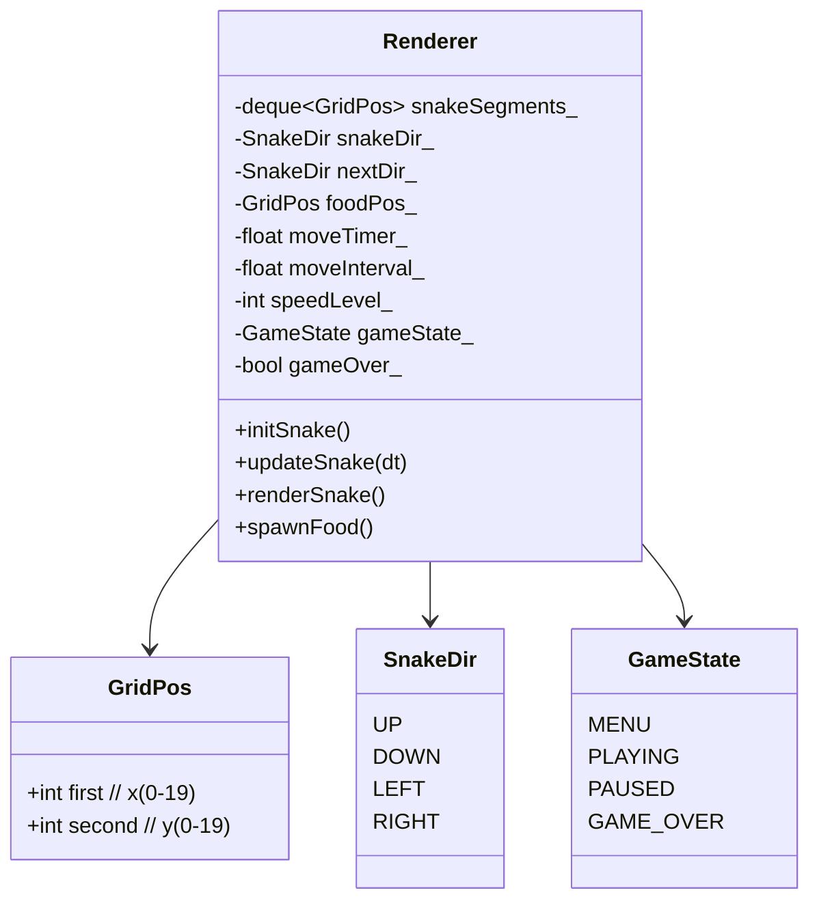
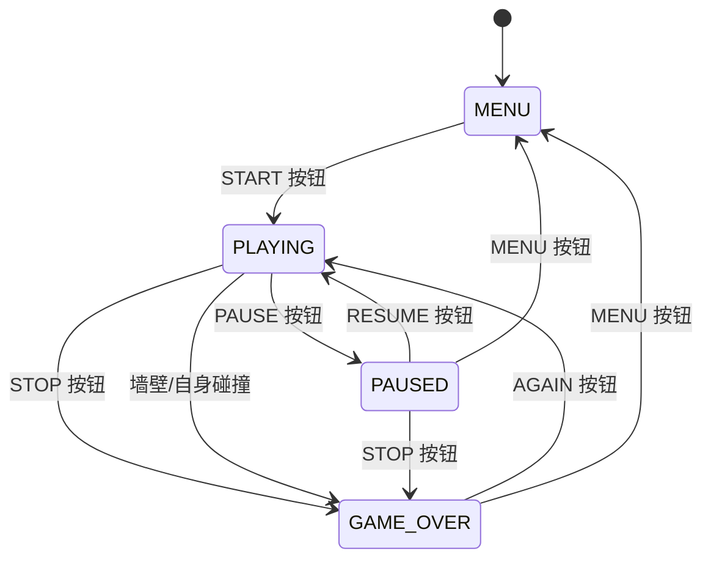
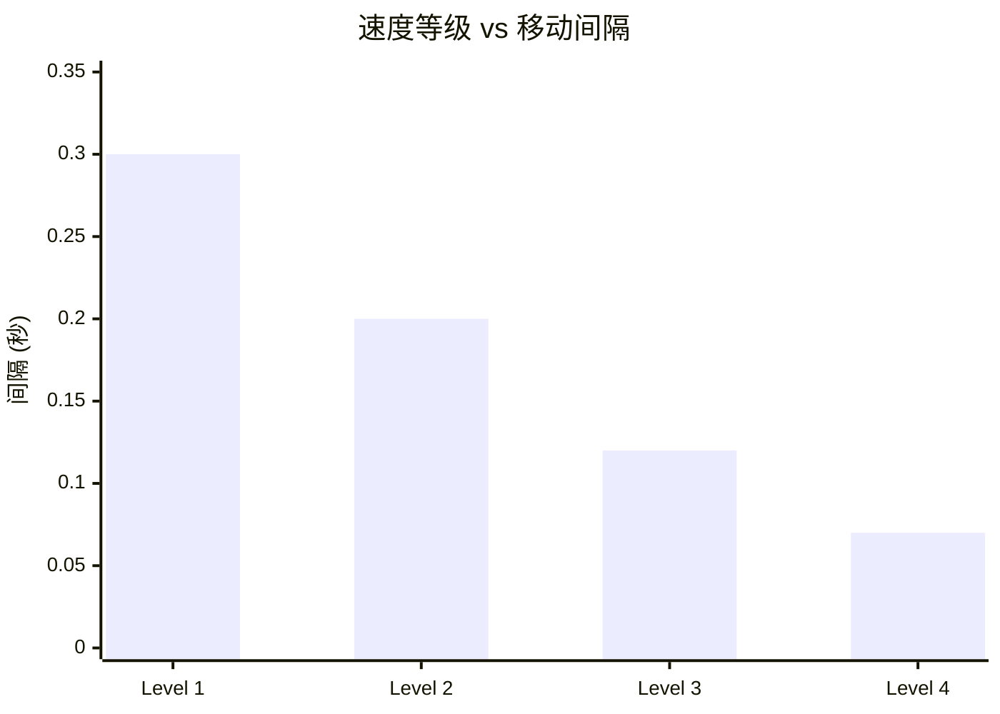
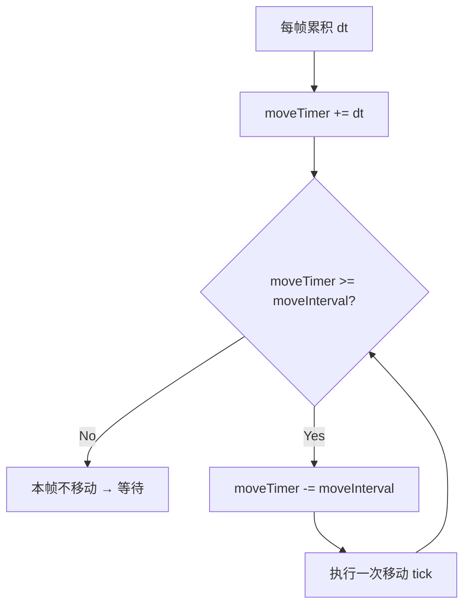
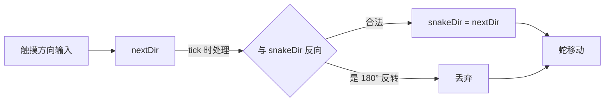
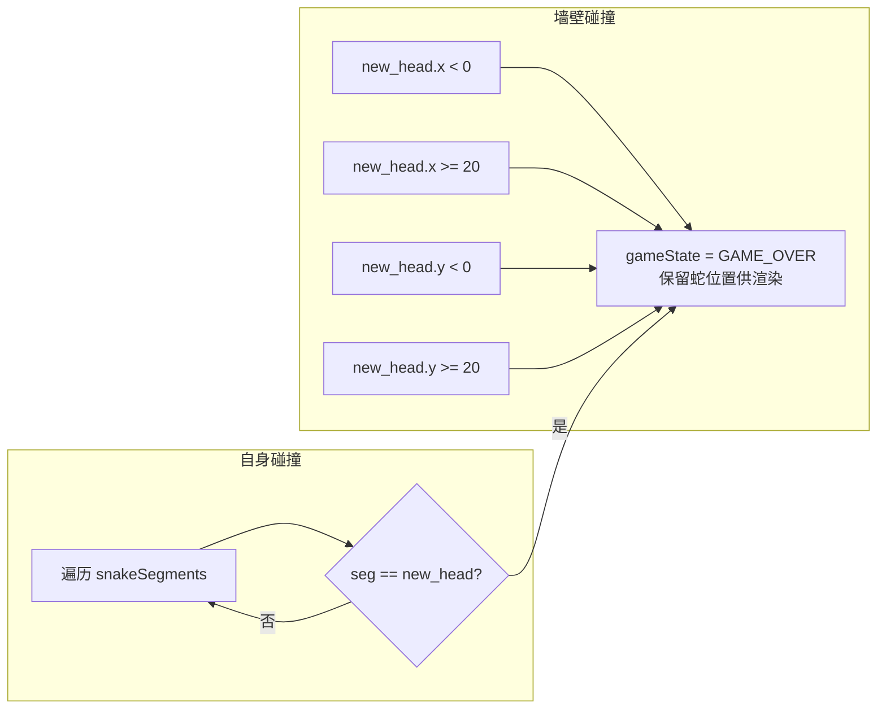
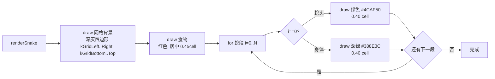

# SnakeShot 蛇游戏逻辑规格

**版本:** v2
**状态:** draft
**负责人:** DE

---

## 1. 概述

经典贪吃蛇游戏逻辑，在 20×20 网格上运行，计时器驱动的逐帧移动，4 级速度。

## 2. 核心数据结构



## 3. 网格映射

```mermaid
flowchart LR
    subgraph 游戏坐标
        GX[gridX 0-19]
        GY[gridY 0-19]
    end
    subgraph UI 归一化坐标
        UX[uiX = 0.13 + (gx+0.5) × 0.037]
        UY[uiY = 0.14 + (gy+0.5) × 0.037]
    end
    GX --> UX
    GY --> UY
    GX -->|范围| XR[0.13 ~ 0.87]
    GY -->|范围| YR[0.14 ~ 0.88]
```

```
网格常量:
  kGridLeft   = 0.13
  kGridBottom = 0.14
  kCellSize   = 0.037

映射公式:
  uiX(gx) = 0.13 + (gx + 0.5) * 0.037
  uiY(gy) = 0.14 + (gy + 0.5) * 0.037
```

## 4. 游戏状态机



## 5. 蛇初始化

```mermaid
flowchart LR
    A[清空 snakeSegments] --> B[中点 (10,10) 为蛇头]
    B --> C[追加 (9,10)]
    C --> D[追加 (8,10)]
    D --> E[初始方向 RIGHT]
    E --> F[reset moveTimer=0]
    F --> G[moveInterval = kMoveIntervals[speed-1]]
    G --> H[gameOver=false]
    H --> I[spawnFood]
```

```
初始蛇身: (10,10) ← (9,10) ← (8,10)
                 头          身1         尾
初始方向: RIGHT
```

## 6. 移动系统

### 速度等级



| 等级 | 间隔 | 近似 TPS | 描述 |
|------|------|----------|------|
| 1 | 0.30s | 3.3 | 慢 |
| 2 (默认) | 0.20s | 5.0 | 中等 |
| 3 | 0.12s | 8.3 | 快 |
| 4 | 0.07s | 14.3 | 极快 |

### 每帧计时器



## 7. 移动逻辑 (单次 tick)

```mermaid
flowchart TB
    A{gameOver?} -->|Yes| EXIT[return]
    A -->|No| B[moveTimer += dt]
    B --> C{moveTimer < moveInterval?}
    C -->|Yes| EXIT
    C -->|No| D[moveTimer -= moveInterval]

    D --> E[方向解析]
    E --> F[nextDir 合法<br/>非 180° 反转]
    F -->|合法| G[snakeDir = nextDir]
    F -->|非法| H[保持 snakeDir]

    G --> I[计算新蛇头位置]
    H --> I
    I --> J{方向}
    J -->|UP| K[head.second++]
    J -->|DOWN| L[head.second--]
    J -->|LEFT| M[head.first--]
    J -->|RIGHT| N[head.first++]

    K & L & M & N --> WALL{墙壁碰撞<br/>head 超出 [0,19]}
    WALL -->|是| GO1[gameState = GAME_OVER<br/>return]
    WALL -->|否| SELF{自身碰撞<br/>head 在 body 中}

    SELF -->|是| GO2[gameState = GAME_OVER<br/>return]
    SELF -->|否| PUSH[snakeSegments.push_front(head)]

    PUSH --> FOOD{head == foodPos?}
    FOOD -->|是| EAT[spawnFood()<br/>不 pop tail → 长度+1]
    FOOD -->|否| POP[snakeSegments.pop_back()]
```

## 8. 方向控制系统



### 180° 反转禁止规则
```
nextDir=UP   → 允许: snakeDir ≠ DOWN
nextDir=DOWN → 允许: snakeDir ≠ UP
nextDir=LEFT → 允许: snakeDir ≠ RIGHT
nextDir=RIGHT→ 允许: snakeDir ≠ LEFT
```

## 9. 碰撞判定



```
碰撞触发时机: push_front 之前
  墙壁: head 坐标 >= 20 或 < 0
  自身: head 与已有任意段坐标相同
碰撞后: gameOver flag 阻止后续移动，等待用户操作
```

## 10. 食物系统

### 生成流程

```mermaid
flowchart TB
    A[清空 empty 列表] --> B[遍历 gridSize x gridSize]
    B --> C{格子被蛇占据}
    C -->|是| D[跳过]
    C -->|否| E[加入 empty 列表]
    D --> F[下一个格子]
    E --> F
    F --> G[empty 非空]
    G -->|是| H[foodPos = empty[rand % size]]
    G -->|否| I[无空位 → 游戏胜利<br/>当前未实现]
```

### 被吃后
```
head == foodPos
  → spawnFood() 重新生成
  → 不 pop_back → 蛇长度 +1
```

## 11. 蛇渲染顺序



### 单元格尺寸
```
食物: halfSize = kCellSize × 0.45  (居中)
蛇身: halfSize = kCellSize × 0.40  (不居中)
```
