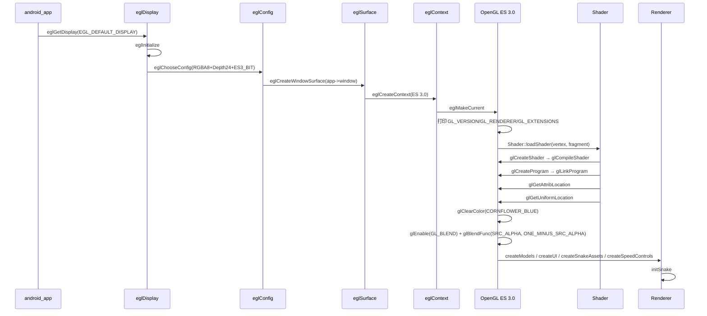
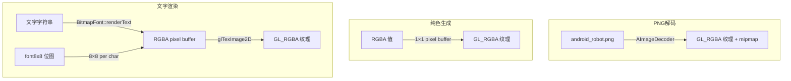

# SnakeShot OpenGL ES 3.0 渲染管线规格

**版本:** v2
**状态:** draft
**负责人:** SA

---

## 1. 概述

使用 OpenGL ES 3.0 进行纯原生 GPU 渲染。所有 UI 元素、蛇网格、文字均通过纹理四边形渲染，单 Shader 程序驱动。

## 2. EGL 上下文规格

### EGL 配置参数
```
RGBA8 + Depth24 + ES 3.0 Context + Window Surface
```

### 初始化时序



## 3. 渲染管线 (每帧)

```mermaid
flowchart TB
    START([每帧开始]) --> T1[updateRenderArea<br/>查询 EGL 尺寸<br/>变化则更新 viewport + 投影矩阵]
    T1 --> T2[设置游戏正交投影<br/>halfHeight=2, aspect-aware]
    T2 --> T3[glClear COLOR_BUFFER_BIT<br/>cornflower blue]

    subgraph GamePass [游戏模型渲染]
        T3 --> T4[for each model in models_]
        T4 --> T4a[Shader::drawModel]
        T4a --> T44{还有下一个}
        T44 -->|Yes| T4
        T44 -->|No| T5
    end

    T5[切换 UI 投影矩阵<br/>[0,1] 归一化 → NDC [-1,1]] --> T6

    subgraph SnakePass [蛇逻辑+渲染]
        T6 --> T7{gameState==PLAYING?}
        T7 -->|Yes| T8[updateSnake(dt)]
        T7 -->|No| T9{snake非空}
        T8 --> T9
        T9 -->|Yes| T10[renderSnake]
        T9 -->|No| T11
        T10 --> T11
    end

    subgraph UIPass [UI 渲染]
        T11 --> T12[for each button<br/>visibleIn==gameState]
        T12 --> T13[Shader::drawModel]
        T13 --> T12
        T12 --> T14{gameState==MENU?}
        T14 -->|Yes| T15[draw speedDown/speedLabel/speedUp]
        T14 -->|No| T16
        T15 --> T16
    end

    T16[eglSwapBuffers] --> START
```

## 4. Shader 生命周期

```mermaid
flowchart LR
    A[Shader::loadShader] --> B[glCreateShader VERTEX]
    A --> C[glCreateShader FRAGMENT]
    B --> D[glShaderSource → glCompileShader]
    C --> E[glShaderSource → glCompileShader]
    D --> F{编译成功}
    E --> G{编译成功}
    F -->|失败| H[log + glDeleteShader → return null]
    G -->|失败| H
    F -->|成功| I[glCreateProgram]
    G -->|成功| I
    I --> J[glAttachShader V+FS → glLinkProgram]
    J --> K{链接成功}
    K -->|失败| L[log + glDeleteProgram → return null]
    K -->|成功| M[glGetAttribLocation position/uv<br/>glGetUniformLocation uProjection]
    M --> N{attribs != -1?}
    N -->|失败| O[glDeleteProgram]
    N -->|成功| P[return new Shader]

    A2[Shader::drawModel] --> B2[glVertexAttribPointer position (3 floats)]
    B2 --> C2[glEnableVertexAttribArray position]
    C2 --> D2[glVertexAttribPointer uv (2 floats, offset=sizeof Vector3)]
    D2 --> E2[glEnableVertexAttribArray uv]
    E2 --> F2[glActiveTexture GL_TEXTURE0]
    F2 --> G2[glBindTexture TEXTURE_2D]
    G2 --> H2[glDrawElements TRIANGLES]
    H2 --> I2[glDisableVertexAttribArray uv/position]
```

## 5. Model 数据结构

```mermaid
classDiagram
    class Vector3 {
        +union { float x, y, z; float idx[3]; }
    }
    class Vector2 {
        +union { float x, y; float u, v; float idx[2]; }
    }
    class Vertex {
        +Vector3 position
        +Vector2 uv
    }
    class Index {
        +uint16_t
    }
    class Model {
        -vector~Vertex~ vertices
        -vector~Index~ indices
        -shared_ptr~TextureAsset~ texture
        +getVertexData() void*
        +getIndexData() void*
        +getIndexCount() int
        +getTexture() TextureAsset&
    }
    class TextureAsset {
        -GLuint textureID
        +loadAsset(assetManager, path) shared_ptr
        +createColor(r,g,b,a) shared_ptr
        +createText(r,g,b,a,text,scale) shared_ptr
        +getTextureID() GLuint
    }

    Vertex --> Vector3
    Vertex --> Vector2
    Model --> Vertex
    Model --> Index
    Model --> TextureAsset
```

### 四边形顶点布局

```
索引: [0, 1, 2,  0, 2, 3]   // 2 个三角形

顶点顺序:
  0: 右上  (+1, +1)  UV(1, 0)
  1: 左上  (-1, +1)  UV(0, 0)
  2: 左下  (-1, -1)  UV(0, 1)
  3: 右下  (+1, -1)  UV(1, 1)

注意: UV y 轴翻转 (像素 top-down → GL bottom-up)
```

## 6. 纹理系统

### 三种纹理来源



### 纹理用途

| 来源 | 使用场景 | 颜色 |
|------|----------|------|
| PNG | 游戏背景图 | `android_robot.png` |
| 纯色 | 蛇头 | 绿 `#4CAF50` |
| 纯色 | 蛇身 | 深绿 `#388E3C` |
| 纯色 | 食物 | 红 `#F44336` |
| 纯色 | 网格背景 | 深灰 `#222222` (alpha=200) |
| 文字 | 所有按钮文字 + 标签 | 白字 + 彩色背景 |

## 7. 位图字体系统

```mermaid
flowchart LR
    CH[ASCII code 32-127] -->|8 bytes/char| FONT[font8x8[96][8]]
    FONT -->|每 byte = 1 列| RENDER[renderText]
    RENDER -->|scale + padding| BUF[RGBA buffer]
    BUF --> UPLOAD[glTexImage2D → GL_RGBA]

    SCALE[fontScale calculation] --> RENDER
    SCALE -->|width/960<br/>clamp 2-4| SCALE
```

### 缩放逻辑
```
fontScale = max(2, min(4, width_ / 960))
  width ≤ 960px  → scale=2
  960-1440px     → scale=3
  ≥ 1440px       → scale=4
```

## 8. 渲染常量

```
CORNFLOWER_BLUE      = RGB(100/255, 149/255, 237/255)  // glClearColor
kProjectionHalfHeight = 2.0
kProjectionNearPlane  = -1.0
kProjectionFarPlane   = 1.0

kGridLeft   = 0.13   // 蛇网格左边界 (归一化)
kGridBottom = 0.14   // 蛇网格底边界 (归一化)
kCellSize   = 0.037  // 每格大小 (归一化)
```
