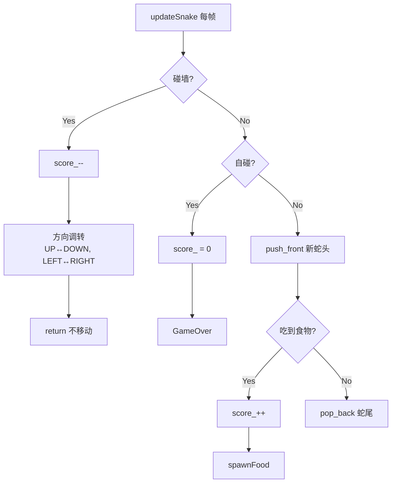
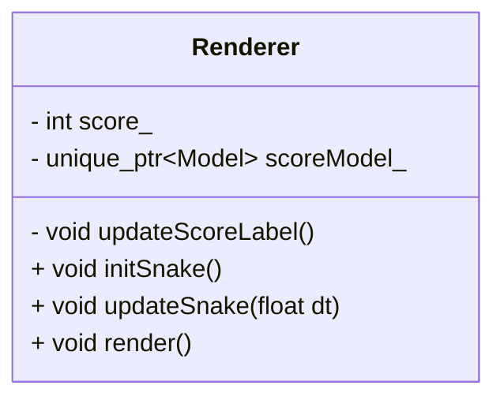
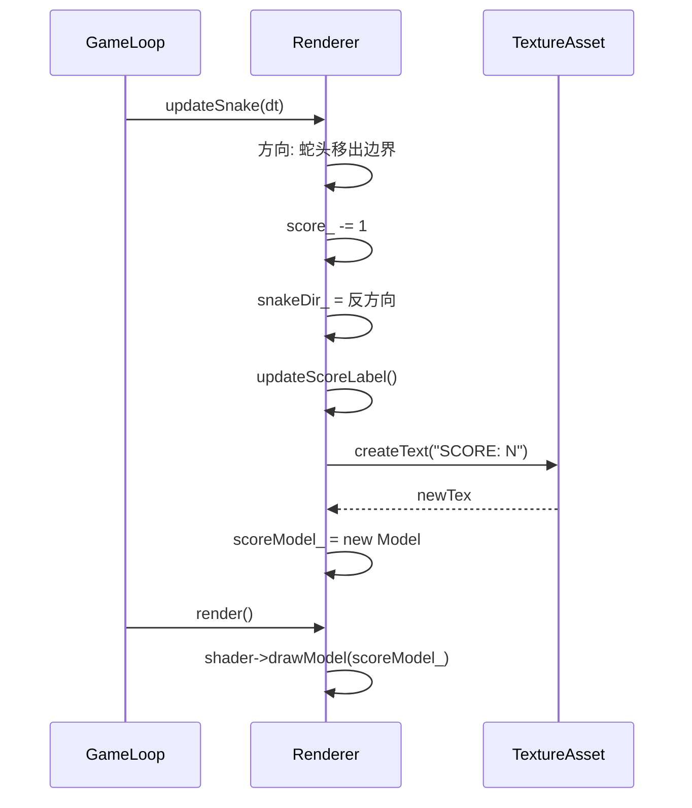

# Scoring 计分功能规格

## 概述
为 SnakeShot 添加计分系统：蛇吃食物加分，碰墙减分并调转方向，GameOver 计分清零，左上角实时显示。

## 功能需求 (SHALL)

### SHALL-001: 食物加分
当蛇头移动到食物所在格子时，分数 +1，并播放吃食物音效。

**GWT 验收**:
- Given 蛇在 PLAYING 状态，当前分数为 N
- When 蛇头移动到食物坐标 (foodX, foodY)
- Then 分数变为 N+1，食物重新生成

### SHALL-002: 碰墙减分 + 方向调转
当蛇头尝试移动到网格边界之外时，分数 -1，蛇的前进方向反向调转，不触发 GameOver。

**GWT 验收**:
- Given 蛇在 PLAYING 状态，当前方向为 DIR
- When 蛇头移动到 (gridX, gridY) 超出 [0, gridSize) 范围
- Then 分数减 1，方向调转为 DIR 的反方向（UP↔DOWN, LEFT↔RIGHT），蛇头停留在原地

### SHALL-003: GameOver 计分清零
当蛇头撞到自身身体（自碰）时，分数重置为 0。

**GWT 验收**:
- Given 蛇在 PLAYING 状态，当前分数为 N
- When 蛇头移动到某身体格子坐标
- Then 分数变为 0，游戏进入 GAME_OVER 状态

### SHALL-004: 分数实时显示
在 PLAYING 状态时，屏幕左上角用白色文字显示当前分数。

**GWT 验收**:
- Given 游戏处于 PLAYING 状态
- When 分数发生变化（加分/减分/清零）
- Then 左上角文字 "SCORE: N" 立即更新

### SHALL-005: 分数支持负值
碰墙减分后分数可能为负数，显示时带负号前缀。

**GWT 验收**:
- Given 当前分数为 0
- When 碰墙 3 次
- Then 分数显示 "SCORE: -3"

## 技术设计

### 框架图
```mermaid
graph TD
    subgraph Renderer
        score_[int score_]
        scoreModel_[unique_ptr<Model> scoreModel_]
        updateScoreLabel[updateScoreLabel()]
        initSnake[initSnake()]
        updateSnake[updateSnake()]
        render[render()]
    end
    updateScoreLabel --> TextureAsset::createText
    render --> scoreModel_
    updateSnake --> score_
    initSnake --> score_
```

### 逻辑流程图


### 类图


### 时序图


## 追溯矩阵

| SHALL | 实现文件 | 测试用例 |
|-------|---------|---------|
| SHALL-001 | Renderer.cpp updateSnake() | ScoringLogic.EatFoodIncrementsScore |
| SHALL-002 | Renderer.cpp updateSnake() | ScoringLogic.WallCollisionDecrementsScore, ScoringLogic.WallCollisionDirectionReverses, ScoringLogic.WallBounceDoesNotMoveHead |
| SHALL-003 | Renderer.cpp updateSnake() | ScoringLogic.GameOverResetsScore |
| SHALL-004 | Renderer.cpp updateScoreLabel(), render() | ScoreFormat.* |
| SHALL-005 | Renderer.cpp updateScoreLabel() | ScoreFormat.NegativeScore, ScoreFormat.ZeroScore |

## 变更历史
| 版本 | 日期 | 变更内容 |
|------|------|---------|
| v1 | 2026-06-24 | 初始规格 |
