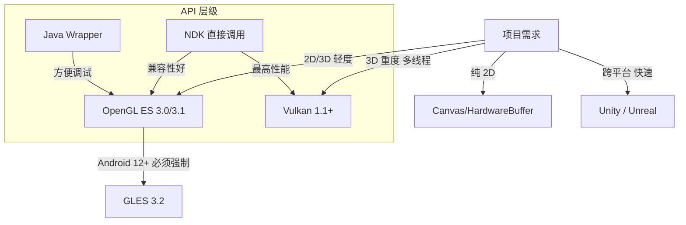
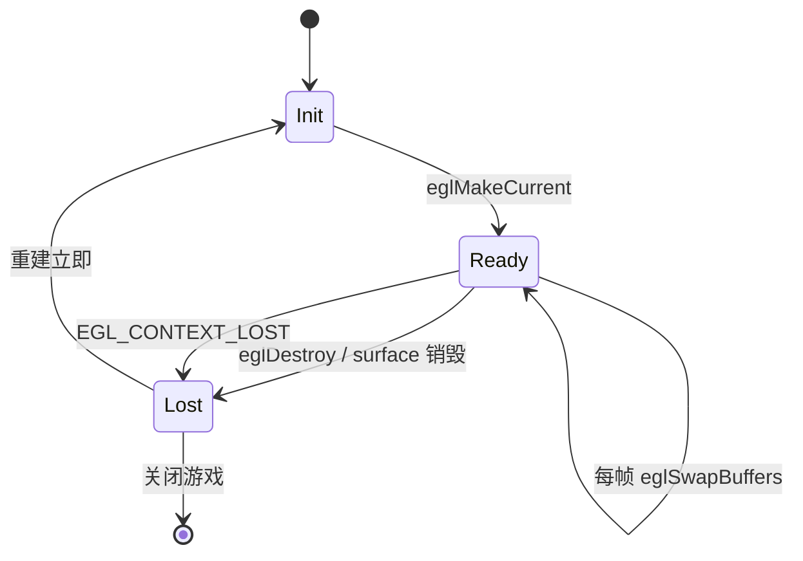
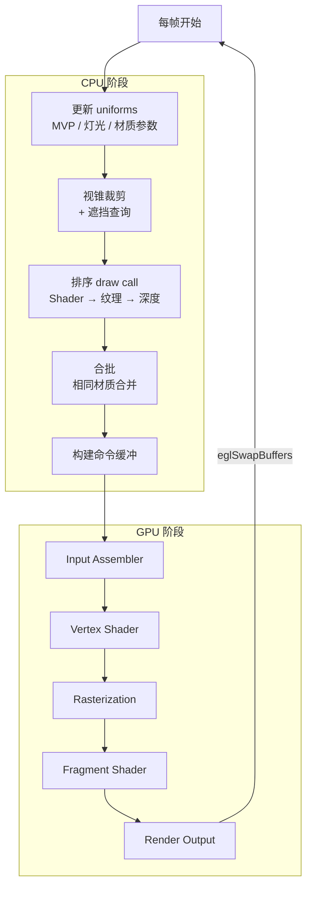
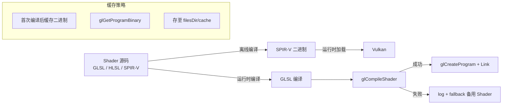
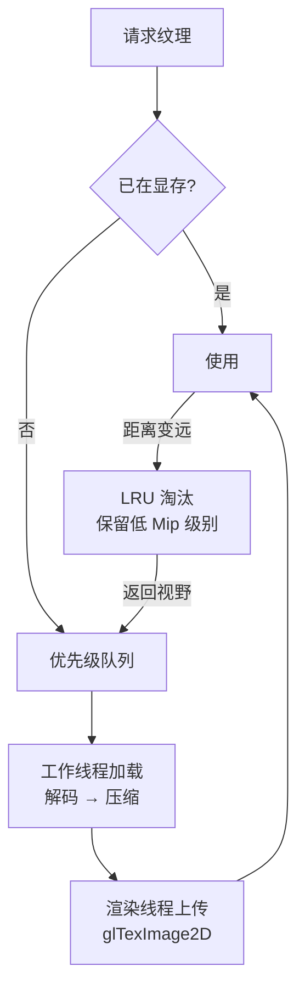

# Android 图形渲染管线标准

> 行业标准参考：OpenGL ES 3.0 规范、Vulkan 1.3 规范、Google Graphics Best Practices

---

## 1. API 选型



### 选型决策矩阵

| 因素 | OpenGL ES 3.x | Vulkan 1.x |
|------|--------------|------------|
| 设备覆盖率 | ~98% (3.0+) | ~65% (1.1+) |
| CPU 开销 | 中 (驱动开销) | 低 (显式控制) |
| 多线程渲染 | 困难 (单线程) | 原生支持 |
| 调试工具 | RenderDoc, GAPID | RenderDoc, GPU Inspector |
| 开发复杂度 | 低 | 高 |
| Shader 灵活性 | 中 | 高 (SPIR-V) |

## 2. GLES 3.0 环境设置

### EGL 配置标准

```yaml
EGL 属性推荐值:
  EGL_RENDERABLE_TYPE: EGL_OPENGL_ES3_BIT
  EGL_SURFACE_TYPE: EGL_WINDOW_BIT
  EGL_RED_SIZE:      8
  EGL_GREEN_SIZE:    8
  EGL_BLUE_SIZE:     8
  EGL_ALPHA_SIZE:    8      # 建议启用透明度
  EGL_DEPTH_SIZE:    24     # 3D 游戏必需，2D 可选 0
  EGL_STENCIL_SIZE:  8      # 需要 stencil 时启用
  EGL_SAMPLE_BUFFERS: 0     # 关闭 MSAA (建议 use_frame_buffer_MSAA)
```

### Context 生命周期



### EGL 错误恢复

```cpp
// 标准恢复流程
if (eglSwapBuffers(display, surface) == EGL_FALSE) {
    EGLint err = eglGetError();
    if (err == EGL_BAD_SURFACE || err == EGL_CONTEXT_LOST) {
        // 重建 surface 和/或 context
        surface = eglCreateWindowSurface(display, config, window, nullptr);
        if (surface == EGL_NO_SURFACE) {
            // 窗口不可用，等待 APP_CMD_INIT_WINDOW
            return;
        }
        eglMakeCurrent(display, surface, surface, context);
    }
}
```

## 3. 渲染管线标准化



## 4. 着色器管理

### 编译管线



### Shader 性能指南

```
1. 精度修饰符
   highp:  顶点位置、光照计算
   mediump: 纹理坐标、颜色
   lowp:   简单颜色混合

2. 条件分支
   避免: 片元着色器中动态分支（warp divergence）
   推荐: 将分支上提到顶点着色器

3. 纹理采样
   纹理数量: 建议 ≤ 8 (GLES 3.0 最小 = 16)
   纹理格式: ETC2 / ASTC (推荐) 替代 RGBA (带宽 4x 差异)

4. 避免的操作
   - 片元中 texelFetch 替代纹理采样
   - 可变长度循环
   - 片元中计算矩阵求逆
```

## 5. 渲染性能预算

### 帧时间预算 (60fps 目标)

```
总预算: 16.67ms

CPU 端:
  ├─ Input:       0.5ms
  ├─ Update:      2-4ms   (逻辑/物理/AI)
  ├─ Culling:     0.5ms
  ├─ Draw Call:   2-4ms   (排序/合批)
  └─ Buffer:      1ms     (uniform/texture upload)

GPU 端:
  ├─ Vertex:      2-3ms
  ├─ Fragment:    3-5ms
  └─ Blit/Swap:   1-2ms   (eglSwapBuffers 阻塞)

安全裕量: 2ms 以上
```

### Draw Call 预算

```
设备分级          Draw Call 上限
Low-end:          < 100
Mid-range:        < 300
High-end:         < 1000

合批优化目标:
  静态物体:  合并为 1 call (static batching)
  动态物体:  ≤ 50 calls per frame
  UI:        ≤ 30 calls per frame
```

## 6. 纹理管理标准

### 纹理格式选择

| 格式 | 压缩比 | 质量 | 支持范围 | 推荐用途 |
|------|--------|------|---------|---------|
| ETC2 | 6:1 | 中 | GLES 3.0+ (100%) | 漫反射贴图 |
| ASTC 4x4 | 4:1 | 高 | GLES 3.2+ / Vulkan | 高质量纹理 |
| ASTC 8x8 | 16:1 | 低 | GLES 3.2+ / Vulkan | UI/大纹理 |
| RGBA8888 | 无 | 无损 | 全部 | UI/文字/法线 |
| ETC1 | 6:1 | 低 | GLES 2.0+ | 兼容旧设备 |

### 纹理流式加载



## 7. V-Sync 与帧 pacing

```mermaid
sequenceDiagram
    participant APP as App
    participant SF as SurfaceFlinger
    participant HW as Hardware Composer

    APP->>SF: eglSwapBuffers
    SF->>HW: queueBuffer
    HW-->>SF: V-Sync 信号
    Note over SF: 等待 ~16ms
    SF->>HW: present
    HW->>HW: 显示
    SF->>APP: dequeueBuffer (下一帧)
    Note over APP: 开始下一帧

    Note over APP,SF: 缓冲区乒乓:
    APP -[#blue]> SF: Buffer A (正在渲染)
    SF -[#green]> HW: Buffer B (正在显示)
    Note over SF: Buffer C (空闲)
```

### 帧 spacing 建议

```
固定 60fps: swapInterval(1)  → 每 V-Sync 交换
固定 30fps: swapInterval(2)  → 每 2 V-Sync 交换
自适应:     跟踪最近 10 帧耗时，动态调整品质
```
